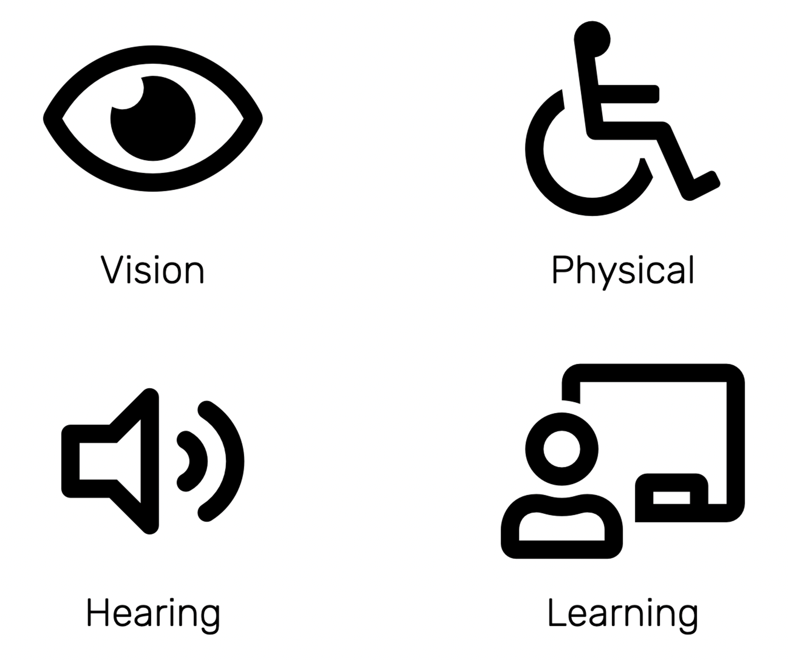
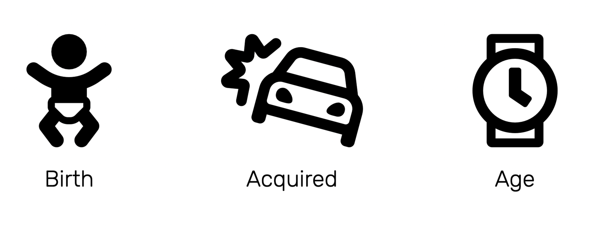
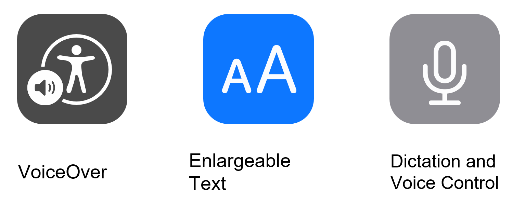
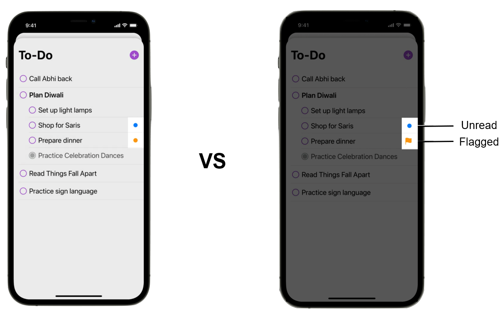
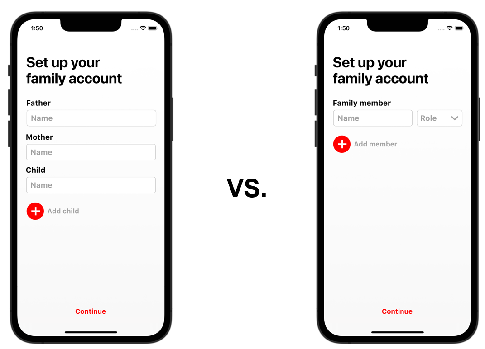
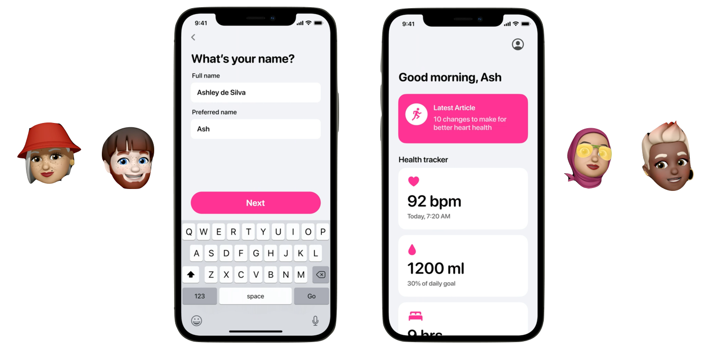
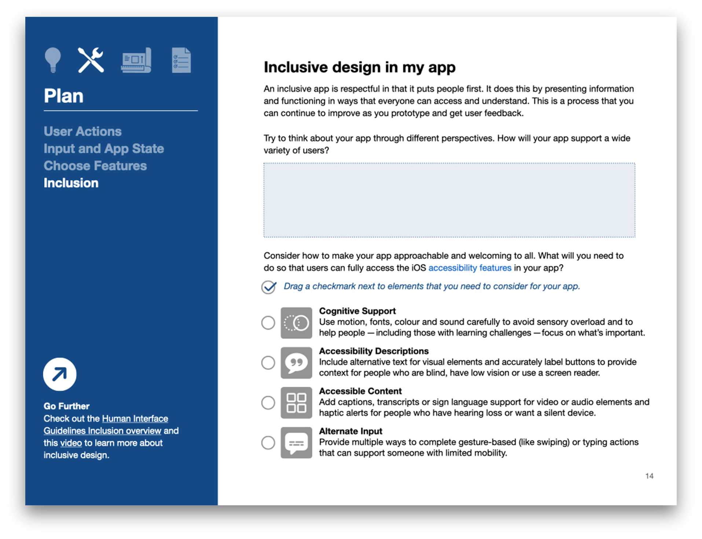

    
    

## Track A: Unit 4

# Designing

Inclusive App Design

---

# 15%

## of the world’s population live with disabilities

---vertical---

---vertical---

---vertical---

## What is inclusive design?

- Design with consideration for the wide variety of human experiences and circumstances behind each user
- This includes differences in disability, but also gender, race, culture, and technological access
- Inclusive design enables app designers — that’s us — to design experiences for more potential users, no matter their circumstances

---

# Accessibility

---vertical---

## Accessibility Features

---vertical---

## The process of inclusive design

- [Video](https://developer.apple.com/videos/play/wwdc2021/10304/?cid=pm-enus-atlc-na-edu-eccode-launch22)

<!-- <iframe width="1600" height="800"
src="https://www.youtube.com/embed/qDm7GiKra28">
</iframe> -->

---vertical---

# The practice of inclusive design

- [Video](https://developer.apple.com/videos/play/wwdc2021/10275/?cid=pm-enus-atlc-na-edu-eccode-launch22)

<!-- <iframe width="1600" height="800"
src="https://www.youtube.com/embed/eg22JaZWAgs">
</iframe> -->

---

# Inclusion isn’t _only_ about disability

---vertical---

## Clarity

---vertical---

## Inclusive Language

---vertical---

## Self Expression & Individuality

---vertical---

    

    <h2>Hands-on</h2>
    <ul>
        <li>In the <strong>App Journal</strong>, fill in Page 14 on <strong>Inclusion</strong>.</li>
        <li>You can check out other apps and how they integrate inclusive features in their apps!</li>
    </ul>
    

    

