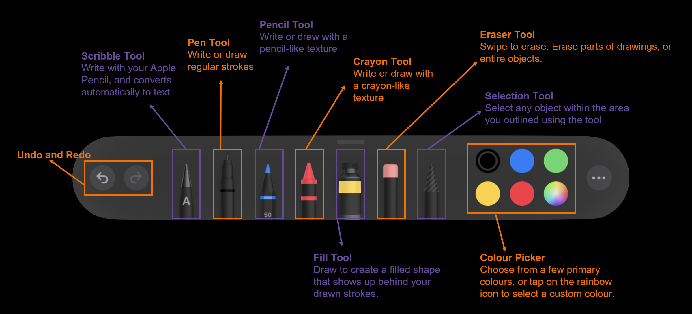

    
    

## Track A: Unit 5

# Intro to Freeform

Introduction to Freeform and its tools

---

# Freeform

---vertical---

## Freeform

- A free Apple app for Mac, iPhone, and iPad, designed for creative brainstorming and collaboration.
- If you’ve used drawing tools for Keynote or Notes, it’s pretty much the same as those — just designed for collaborative editing, on an infinite canvas (board).
- Create expandable “boards”, and add text, drawings with various brushes, fills, shapes, sticky notes, and media

---vertical---

## Why Freeform

- With Freeform, you can...
- Create simple app designs to experiment with different concepts of what you want to do
- Create infinitely sized “boards”, and add text, drawings with various tools, fills, shapes, sticky notes and links

---

# Creating a board

---vertical---

## Creating a new board

    <ul>
        <li>Click on the (edit) symbol near the top middle of the screen.</li>
        <ul>
            <li>This should open a new board for you.</li>
            <li>Until you rename or edit the board, it will not be saved.</li>
        </ul>
    </ul>

---vertical---

## Renaming your board

    <ul>
        <li>Rename your board to ‘what the board is about’</li>
        <ul>
            <li>For example, ‘Swift Explorers’</li>
        </ul>
        <li>To do this,</li>
        <ul>
            <li>On the top right of the screen, Tap on ‘Untitled’</li>
            <li>Type in the new name of the board</li>
        </ul>
    </ul>

---

# Navigating

## in Freeform

---vertical---

## Zooming your board

- Freeform has an _infinite canvas_
  - As you move around, the canvas will continue to expand
- To **zoom in** or **zoom out** of the canvas, place two fingers on your screen, and do a pinching movement
  - Pinching in zooms in, pinching out zooms out

---vertical---

## Moving around your board

- Freeform has an _infinite canvas_
  - As you move around, the canvas will continue to expand
- To move around, **hold down one finger** on your screen and move it around
  - You can do this simultaneously while zooming in or out

---

# Tools in Freeform

---vertical---

## Drawing Tools

- Tap on a tool to switch to it.
- Tap a second time to see if there are additional options, like stroke size (line thickness) or transparency.

---vertical---

## Tool Picker

---vertical---

## Creating sticky notes

    <ul>
        <li>In Freeform, you can create sticky notes.</li>
        <li>To create one in Freeform, click on the (sticky note icon) button at the top centre of your screen</li>
    </ul>

---vertical---

## Customising sticky notes

    <ul>
        <li>The default colour for these sticky notes is yellow, but you can change it</li>
        <ul>
            <li>Fonts can be changed too</li>
        </ul>
    </ul>

---vertical---

## Using preset shapes

    <ul>
        <li>Freeform has a library of ready-made shapes for you to add to your boards</li>
        <li>Tap on the (shapes icon) button in the toolbar</li>
        <li>Choose a shape</li>
        <ul>
            <li>You can either search for a shape, or search by a category</li>
        </ul>
    </ul>

---vertical---

## Insert media

    <ul>
        <li>Tap on the (picture icon) button at the top centre of your screen</li>
        <li>Select an option for where you’d like to get your media from</li>
        <li>If ‘Link’ is tapped, an object with the link will be created</li>
        <ul>
            <li>This allows you to quickly access webpages from your board</li>
            <li>It will look something like this 👉</li>
        </ul>
    </ul>

---

# Collaboration and exporting

---vertical---

## Freeform Collaboration

    <ul>
        <li>In Freeform, you can collaborate with multiple people on the same document.</li>
        <li>To do so, tap on the (export icon) icon in the top right corner</li>
        <li>Under <strong>Share Options</strong>, set it up such that anyone with the link can make changes.</li>
    </ul>

---vertical---

## Exporting in Freeform

    <ul>
        <li>In Freeform, you can export the canvas so that you can send it as a pdf to anyone.</li>
        <li>To do so, tap on the file name on the top left hand corner</li>
        <li>Press <strong>Export as PDF</strong>, and select the location to save it in</li>
    </ul>

---

# Collaborating

---vertical---

## Keynote Collaboration

    <ul>
        <li>To get started, tap on the (export) icon in the top right corner</li>
        <li>Make sure you set the document to <strong>Collaborate</strong>, not <strong>Send Copy</strong> in the drop-down box.</li>
        <li>Next, share the link by using:</li>
        <ul>
            <li><strong>AirDrop</strong>: If in the same room</li>
            <li><strong>Messages</strong>: If on iMessage</li>
            <li><strong>Mail</strong>: Using email address</li>
            <li><strong>Invite with link</strong>: Paste elsewhere</li>
        </ul>
    </ul>

---vertical---

## Tip: Let Anyone Edit

    <ul>
        <li>Consider using this tip, to avoid having
to set up permissions.</li>
        <li>When sharing, tap on the arrow next to <strong>Only invited people can edit</strong>, and consider changing to <strong>Anyone with the link</strong></li>
        <li>Just be careful not to share the link somewhere else!</li>
    </ul>

---vertical---

## Sharing Options

    <ul>
        <li>Once a document is shared, you’ll see a new button show up (person-icon)</li>
        <li>Tap on it to send the link or set up a collaborative FaceTime call</li>
        <li>See all changes from teammates in <strong>Latest Activity</strong></li>
        <li>Make changes to <strong>Activity Settings</strong> (see cursors, highlights) or <strong>Manage Shared Presentation</strong> (who has access)</li>
    </ul>

---vertical---

## Caveats and Warnings

    <ul>
        <li>One student should create the “master document” first, before sharing</li>
        <li>Some features are not available when sharing on Keynote!</li>
        <ul>
            <li>Changing theme</li>
            <li>Changing slide size — this is important for the final high-fidelity prototype step</li>
        </ul>
    </ul>

