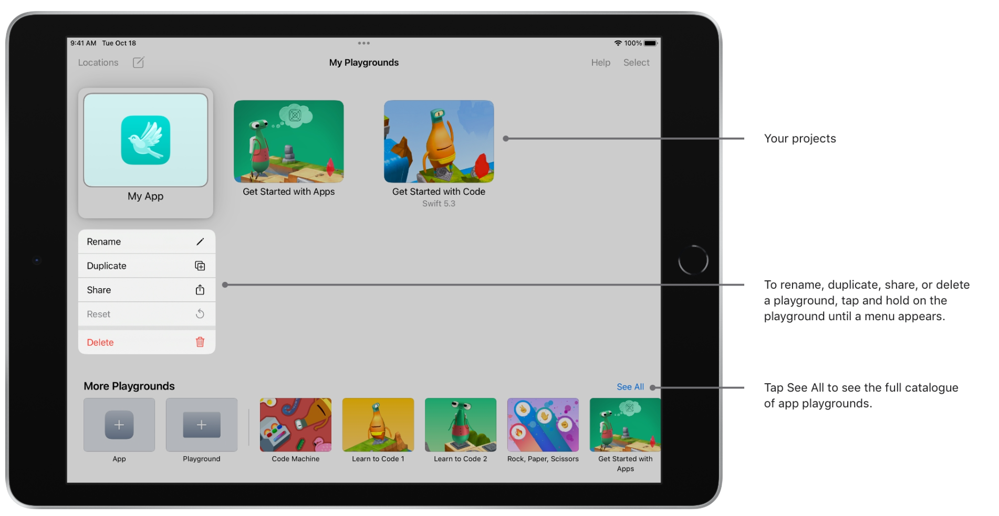
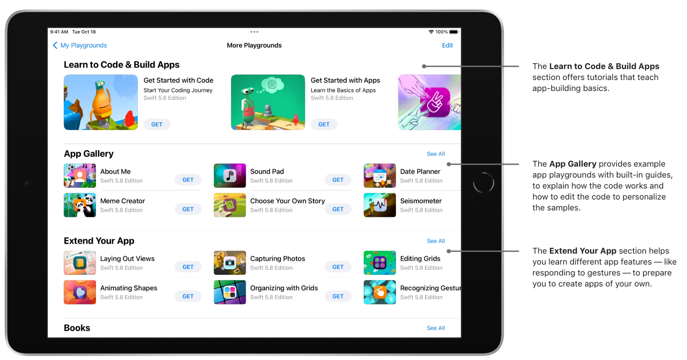
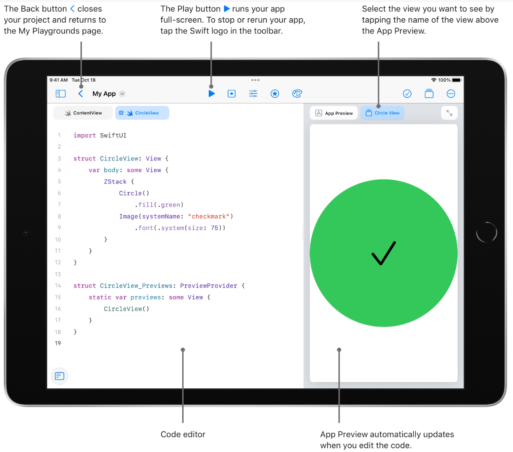
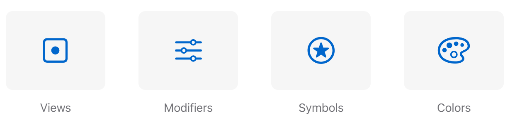
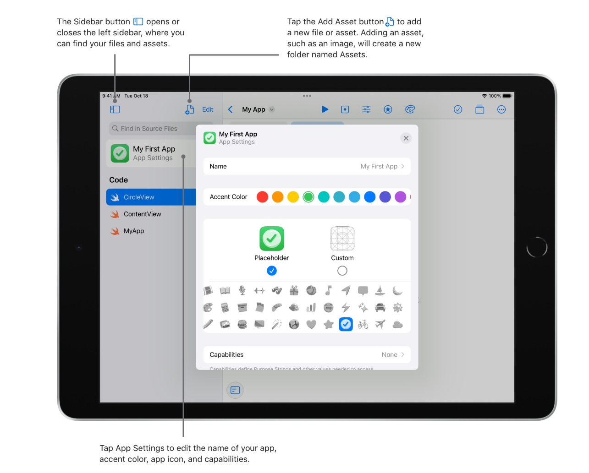
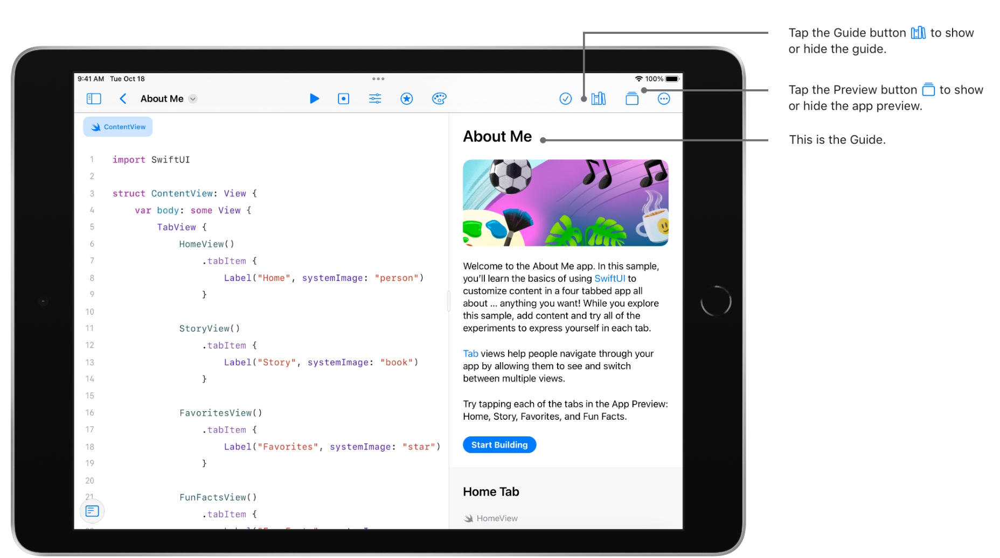
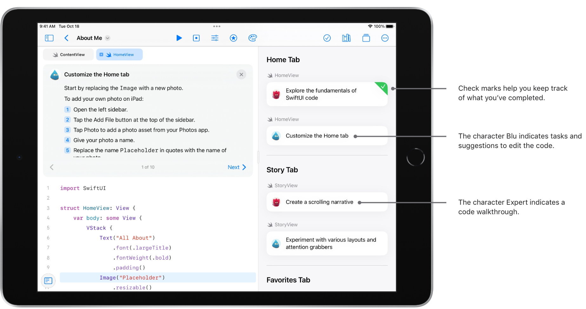
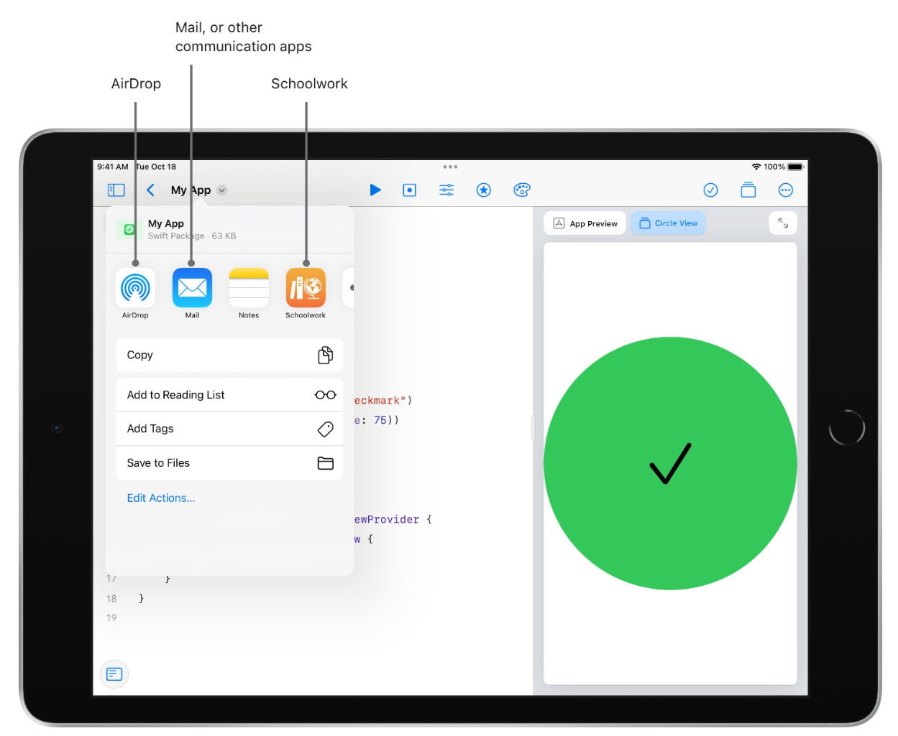

    
    

## Track A: Unit 7

# Get Started with Code

---

# Get Started

---vertical---

## Get Started

Download the Swift Playgrounds app on either iPad or Mac to get started.

**Pro tips**:

- Turn on iCloud Drive to continue working on your app playgrounds from multiple devices.
- If you’re using iPad to view the Learning Center or Keynote and Swift Playgrounds at the same time, tap the Multitasking button Multitasking button  at the top of the screen to use Slide Over or Split View.

[Learn more about multitasking](https://support.apple.com/en-us/102576)

---vertical---

## Open Playgrounds

---vertical---

---

# Write Code

---vertical---

## Write Code

<iframe width="1200" height="800" src="https://www.youtube.com/embed/w0zm686WD8k" frameborder="0" allow="accelerometer; autoplay; clipboard-write; encrypted-media; gyroscope; picture-in-picture" allowfullscreen></iframe>

---vertical---

## Writing Code

---vertical---

## Writing Code

Swift Playgrounds teaches Swift and SwiftUI, the programming technologies created by Apple and used by professionals to build many of today’s most popular apps.

You can add SwiftUI controls, views, modifiers, symbols, and colors from the library by tapping the icons in the toolbar above the coding area.

---vertical---

## Writing Code

---

# Learn Within Playgrounds

---vertical---

## Learn Within Playgrounds

---vertical---

## Learn Within Playgrounds

---

# Share Your App Playground

---vertical---

## Share Your App Playground

There are several options to share your app playgrounds with other people. Tap the app name in the toolbar, then tap the Share button  to bring up the share sheet.

