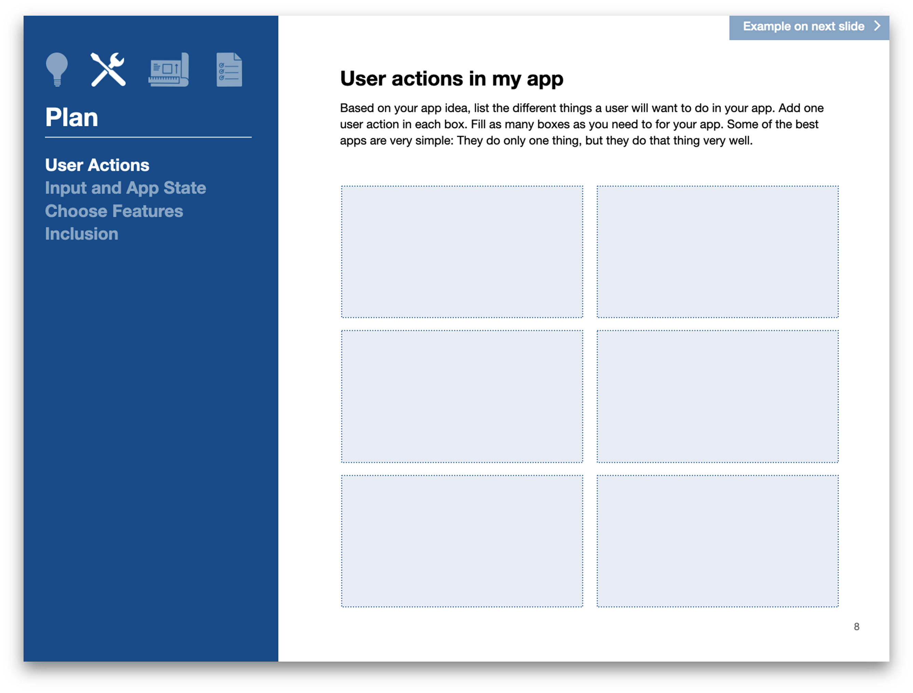
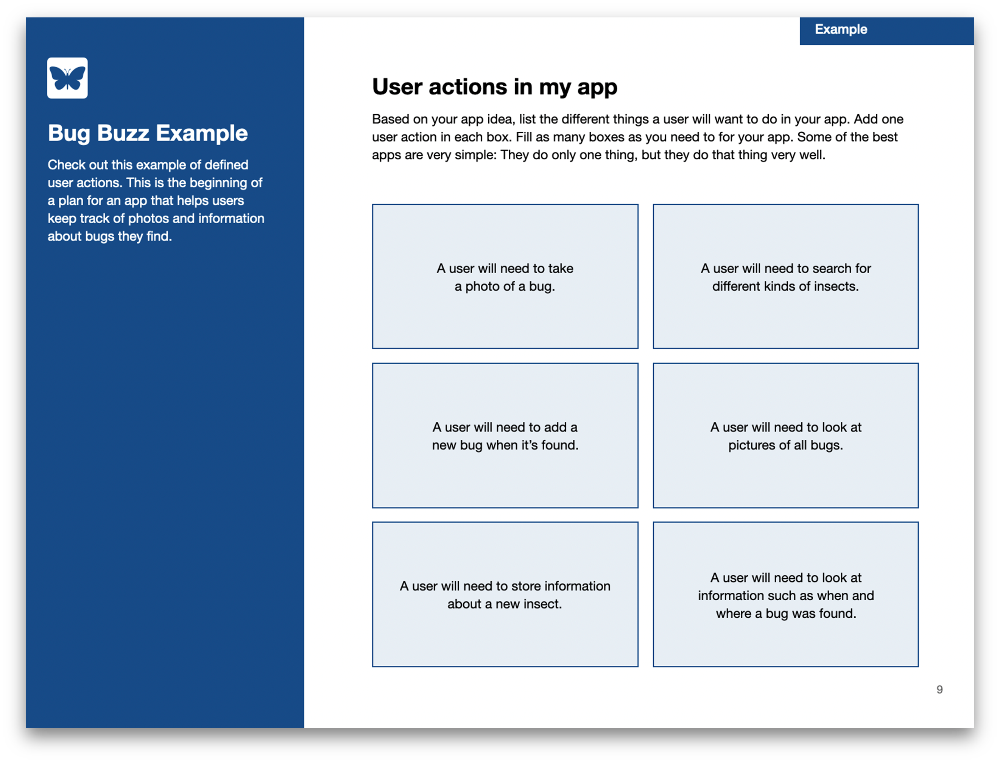
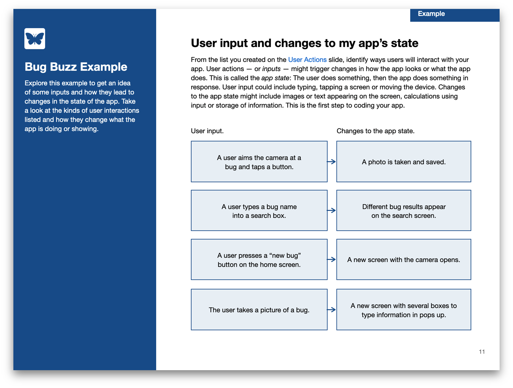
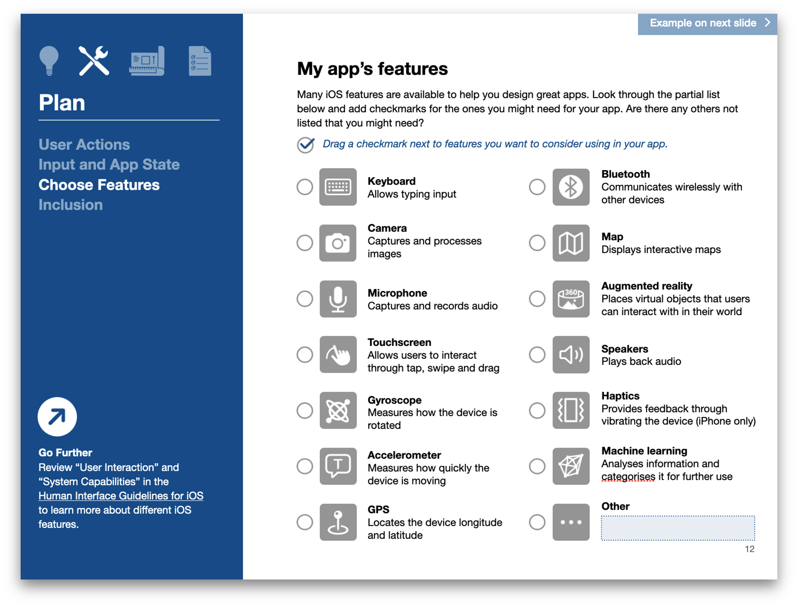
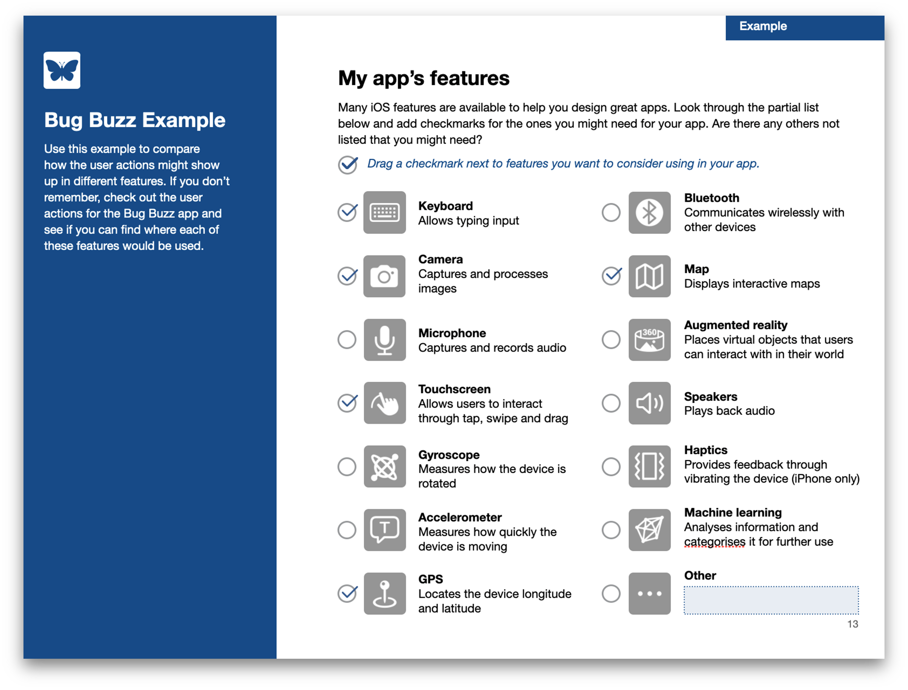

    
    

## Track A: Unit 3

# Planning

Planning your user interface

---

# Actions

---veritcal---

## Actions

- Actions are what your user will do in your app
- Some of the best actions are simple — they do one thing, but do it well
- **Example**: The camera shutter button on the iPhone.
  - All it does is to help you take a photo
  - After you tap it, you know a photo has been taken
  - It’s big and obvious, and almost everyone intuitively knows how to use it

---vertical---

## Hands-On

- In the **App Journal**, fill in Page 8 on **User Actions**.
- Based on your app idea, fill in the boxes with action you think your user will need to do.
- Fill in as many as you need.
- Remember: Sometimes, simple actions are the best.
- Take a look at the example on the subsequent slide, for a bug-tracker app.
  - Not the programming type of bug. Real bugs! 🐛🪲 🐞

---vertical---

---vertical---

---

# 🥚→🐣→🐥→🚀

## Actions & Results

---vertical---

## Hands-On

- In the App Journal, fill in Page 10 on Input and App State.
- From your Actions list, identify a few ways your user will interact with your app.
- This could be typing, tapping or moving the device.
- How will the app respond to each action?
  - Does something appear?
  - Does something save?
- This seems obvious and intuitive… but it’s good to define all these early on, to avoid missing out on anything!

---vertical---

---vertical---

---vertical---

## Hands-On

- In the **App Journal**, fill in page 12, on **Choose Features**
- Based on your Actions & Results, circle the relevant features your app will use!
- Are there any other features not listed you may use?
  - You can go online and find out what new features have been added to iOS, and figure out if they’re useful for your app.
- **Important**: _You don’t have to choose everything!_ That doesn’t improve your app.

---vertical---

---vertical---

---

# Unit 3 Deliverables

---vertical---

# Unit 3 Deliverables (Part 1)

---vertical---

# Unit 3 Deliverables (Part 2)

---vertical---

# Unit 3 Deliverables (Part 3)

