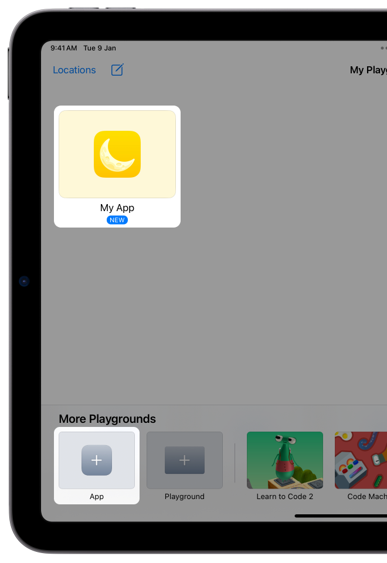
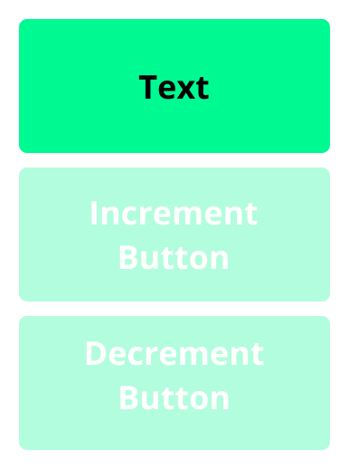

<div style="text-align: left">
    
    
</div>

## Track B: Unit 2
# Counter

Create a Counter app in SwiftUI.

---

## Unit Overview
- [Variables & Types](#variables--types)
- [Buttons](#buttons)
- [States](#states)
- [String Interpolation](#string-interpolation)
- [Conditionals](#conditionals)
- [Write What Where?](#write-what-where)
- [Go Further](#go-further)

---

# Variables & Types
## 🗃️ Very Picky Boxes of Information

---vertical---

## Declaring Variables
- Variables allow you to store information.
    - Think of it like a box of information.
- Naming Variables
    - Names have to start with letters like `myVariable` (or emoji… try `🍕`)
        - Please don’t use emoji variable names… please
    - We name variables in `camelCase` — no spaces, lowercase to start, and capital letter for new words
        - `kindOfLikeThis`

```swift[:]
var numberOfCookies = 10
var myName = "Cookie Monster"
var amIHungry = true
```

---vertical---

## Updating Variables Values
```swift[5-16]
var numberOfCookies = 10
var myName = "Cookie Monster"
var amIHungry = true

// OM NOM NOM
numberOfCookies = 9

// IM STILL HUNGRY
numberOfCookies = 8

// OK IM NOT HUNGRY
amIHungry = false

// JUST KIDDING IM STILL HUNGRY
amIHungry = true
numberOfCookies = 7
```

---vertical---

## Constants
- Constants are like variables, but you can’t change their value.
- You declare them with `let` instead of `var`.
- Used when you know the value won’t change.

```swift
let myName = "Cookie Monster"
let dateOfBirth = "1st January 2010"
```

---vertical---


## Comments
- The grey/green/faded `//` lines are comments
- Just for reading! Swift ignores these. 
- You can also comment with `/*` …anything in between here, 
    
    even new lines... `*/`
```swift
// This is a comment.
/* This is another comment */
/* 
    This is a
    really
    really
    really
    long comment 
*/
```

---vertical---

## Common Variable Types

| Name                            | Swift Name | Description           | Example                                 |
|---------------------------------|------------|-----------------------|-----------------------------------------|
| String                          | `String`   | Texts                 | `"Hello"`, `"123"`, `"true"`, `"Words"` |
| Integer                         | `Int`      | Whole Numbers         | `123`, `-123`, `1`, `0`                 |
| Double-precision floating point | `Double`   | Decimals              | `3.14`, `-1.23`, `0.0`, `1.0`           |
| Boolean                         | `Bool`     | True or False values  | `true`, `false`                         |

…and more, but we won’t get into these yet.

---vertical---

## Type Declaration
- Type Inference
    - Swift automatically infers a type when you declare a variable. 
```swift
var thisIsAString = "Hello"
var thisIsAnInt = 123
var thisIsAnDouble = 3.14
var thisIsAlsoADouble = 3.0
```

- Explicit Type
    - You can also explicitly set the type in Swift.
```swift
var thisIsAnInt = 1
var thisIsADouble: Double = 1
```

---vertical---

## Type Safety
- You cannot change a type of a variable, this concept is known as _Type Safety_.
```swift
var myAmazingString = "Hello"
```
- This will throw you an error as you are attempting to change a variable of type `String` to that of type `Int`.
```swift
myAmazingString = 123 // Throws an error.
// Do you know who I am? I'm a String.
// I don't want your weird numbers. They just aren't my type.
// You know what? I will just crash 💥. I will bring everything down with me.
// What are you going to do about it?
// You can't even string together working code. 
```
- Now you've gotten yourself all tied up in an argument with a `String` and it won't compile unless you give it what it wants.

---

# Buttons
## Tap Tap

---vertical---

## Create a Playground App
<div style="display: flex;">
    <ol>
        <li>Press the  icon to create a new App</li>
        <li>Hold down on the newly created app and tap <strong>Rename</strong></li>
        <li>Name it <strong>“Counter”</strong></li>
        <li>Tap on the app to open it</li>
        <li>Customise the App Settings to your liking.</li>
    </ol>
    
</div>


---vertical---


## Interface Set Up

<div style="display: flex;">
    <div>
    <ol>
        <li>Delete the <code>Image</code> view</li>
        <li>Set the Text's value to <code>"0 Cookies"</code></li>
        <li>In the  <em>Views Library</em>, search for <code>Button</code> and insert two <code>Button</code>s into the <code>VStack</code>.</li>
        <li>Set the titles of the <code>Button</code>s by replacing the  <code style="background: #007AFF; padding: 4px; border-radius: 4px; color: white;">"Button"</code> placeholder. One <code>Button</code> will increment, the other will decrement.</li>
    </ol>
    <p>Feel free to customize the <code>Text</code>'s value and <code>Button</code> titles. 
    <br>
    The examples will be Cookie Monster themed.</p>
    </div>
    
</div>


---vertical---


<div style="display: flex;">
    <div style="">
    <pre><code data-line-numbers="4-10" data-ln-start-from="3" class="hljs language-swift">struct ContentView: View {
    var body: some View {
        VStack {
            Text("0 Cookies")
            Button("I ATE ANOTHER ONE !!!") {
                // Action
            }
            Button("A COOKIE FELL OUT OF MY MOUTH !!!") {
                // Action
            }
        }
    }
}
    </code></pre>
    <p> ContentView.swift</p>
    </div>
    
</div>


---vertical---


## Handling Taps
- Print out a message when the `Button` is tapped!
    - This outputs a message to the console. Not an actual printer 🖨️.

```swift[3:6,9]
struct ContentView: View {
    var body: some View {
        VStack {
            Text("0 Cookies")
            Button("I ATE ANOTHER ONE !!!") {
                print("Increment Cookies")
            }
            Button("A COOKIE FELL OUT OF MY MOUTH !!!") {
                print("Decrement Cookies")
            }
        }
    }
}
```


---


# States
## Variables in SwiftUI


---vertical---


## `@State` Variables
- `@State` is a property wrapper that allows SwiftUI to help you keep track of them.
- Think of a `@State` variable as a noisy child.
    - If you change something, it will yell at everyone and say "HEY I WAS UPDATED" any any `View`s that involve it refresh themselves.
- In order to update your user interface based on a variable's value, it has to be a `@State` variable.

---vertical---

## What We Need
1. A variable to keep track of the number of cookies eaten 🍪.
2. To increment the variable's value when the _"I ATE ANOTHER ONE !!!"_ `Button` is pressed
3. To decrement the variable's value when the _"A COOKIE FELL OUT OF MY MOUTH !!!"_ `Button` is pressed
4. Whenever the variable's value changes the `Text` displaying the number of cookies eaten should refresh.


---vertical---


## Create a `@State` Variable
```swift[3:3]
struct ContentView: View {

    @State private var counter = 0

    var body: some View {
        VStack {
            Text("0 Cookies")
            Button("I ATE ANOTHER ONE !!!") {
                print("Increment Cookies")
            }
            Button("A COOKIE FELL OUT OF MY MOUTH !!!") {
                print("Decrement Cookies")
            }
        }
    }
}
```


---vertical---


## Adjusting Counter's Value
After adjusting the value of `counter`, print it out and check your console to make sure the value of `counter` changes when the `Button` is tapped.

```swift[3:9-10,13-14]
struct ContentView: View {

    @State private var counter = 0

    var body: some View {
        VStack {
            Text("0 Cookies")
            Button("I ATE ANOTHER ONE !!!") {
                counter = counter + 1
                print(counter)
            }
            Button("A COOKIE FELL OUT OF MY MOUTH !!!") {
                counter = counter - 1
                print(counter)
            }
        }
    }
}
```


---vertical---


## Displaying Cookie Count
In order to display the `counter` value in a `Text`, we need to convert it to a `String`. We can convert it's type by using `String(counter)`

```swift[3:7]
struct ContentView: View {

    @State private var counter = 0

    var body: some View {
        VStack {
            Text(String(counter))
            Button("I ATE ANOTHER ONE !!!") {
                counter = counter + 1
                print(counter)
            }
            Button("A COOKIE FELL OUT OF MY MOUTH !!!") {
                counter = counter - 1
                print(counter)
            }
        }
    }
}
```


---


# String Interpolation
## Interpolation (noun)
### The act of introducing or inserting anything, especially that which is spurious or foreign.


---vertical---


## Inserting Variables
- String interpolation allows for variables to be inserted into a `String`. 
- For example, you could insert `name` into `greeting` to form a statement. 

```swift
var name = "Daksh"
var greeting = "Hello \(name)!" 
```
- You can also insert values of other data types
```swift
var name = "Cookie Monster"
var coookiesConsumed = 40
var greeting = "\(name), consumed \(cookiesConsumed) cookies!"
```


---vertical---


## In SwiftUI
```swift[3:7]
struct ContentView: View {

    @State private var counter = 0

    var body: some View {
        VStack {
            Text("\(counter) Cookies")
            Button("I ATE ANOTHER ONE !!!") {
                counter = counter + 1
                print(counter)
            }
            Button("A COOKIE FELL OUT OF MY MOUTH !!!") {
                counter = counter - 1
                print(counter)
            }
        }
    }
}
```

---

# Conditionals
## Making decisions within code

---vertical---

## Hiding Views, Conditionally
Let's say you are trying to write an app to advice users on the weather.

You can use an if-statement like this to display a message. In this case, if `temperature` is less than 10, the `Text` will be hidden. Otherwise, `Text` will be shown.
```swift
if temperature < 10 {
    Text("It's so cold! Wear a winter jacket!!")
}
```


---vertical---


## More Conditions
What if you wanted another `View` to appear if the condition is not met? You can use the `else` clause.
```swift
if temperature < 10 {
    Text("It's so cold! Wear a winter jacket!!")
} else {
    Text("Just a light jacket will suffice!")
}
```


---vertical---


## Even More Conditions
How about accounting for more conditions? We can use else-if.

```swift
if temperature < 10 {
    Text("It's so cold! Wear a winter jacket!!")
} else if temperature > 30 {
    Text("It's so hot! Why go out???")
} else {
    Text("Just a light jacket will suffice!")
}
```
When Swift evaluates these statements, it goes from top to bottom, and only runs the first block where the condition evaluates to `true`. It won’t bother with the rest of the statements!


---vertical---


## Specific Comparisons
- Here’s one more condition, but at a very specific number.
```swift
if temperature < 10 {
    Text("It's so cold! Wear a winter jacket!!")
} else if temperature == 100 {
    Text("Oh hey we can boil water! Also how are you alive?")
} else if temperature > 30 {
    Text("It's so hot! Why go out???")
} else {
    Text("Just a light jacket will suffice!")
}
```
- Notice the use of `==` — that’s what Swift (and other languages) use for comparison. `=`, on the other hand, means “assign the right-side value into the left”.
- If we changed the order of the second and third conditions, and give a temperature of 100, we’ll never get the boil water comment. Any idea why?

---vertical---

## More Numerical Comparators

| Comparator | Description           |
|------------|-----------------------|
| `<`        | Less than             |
| `<=`       | Less than or equal    |
| `>`        | Greater than          |
| `>=`       | Greater than or equal |
| `==`       | Equal                 |
| `!=`       | Not equal             |

---vertical---


## More Examples
```swift
var a = 5

if a == 5 { // Do you like the number 5?
   Text("I’m SOOO happy")
} else if a == 3 { // Do you hate the number 3? 
   Text("I HATE THAT")
} else { // Are you ambivalent about everything else?
   Text("Whatever")
}
```


---vertical---


## Booleans
- Remember booleans, or variables/constants of type Bool? 
    - These variables can only be true or false.
- That’s what the expressions after the word if are evaluating to, e.g. `temperature > 30` evaluates to `true`.
- You can create booleans directly, too, and evaluate them.

```swift
@State private var isRaining = true

if isRaining {
    Text("Bring an umbrella")
}
```

---vertical---


## Hiding the Button
- We want to ensure the `counter` value cannot be less than 0.
- Therefore, we should only show the _A COOKIE FELL OUT OF MY MOUTH !!!!_ `Button` if the number of cookies is greater than 0.

```swift[3:13-18]
struct ContentView: View {
    
    @State private var counter = 0
    
    var body: some View {
        VStack {
            Text("\(counter) Cookies")
            Button("I ATE ANOTHER ONE !!!") {
                counter = counter + 1
                print(counter)
            }
            
            if counter > 0 {
                Button("A COOKIE FELL OUT OF MY MOUTH !!!") {
                    counter = counter - 1
                    print(counter)
                }                
            }
        }
    }
}
```


---


# Write What Where?
## Where do you write pieces of code?


---vertical---


## View Builder vs. Logical Code
```swift
VStack {
    // View Builder Code

    Button("Hello World") {
        // Logical Code
    }
    .mask {
        // View Builder Code
    }
}
```

- _Action_s are Logical code, for example, `Button` actions.
- _Content_s are View Builder code, for example, the content between the curly braces of a `VStack`, or those within the curly braces of a `.mask` modifier.

---vertical---

## Is _this_ View Builder or Logical Code?
- A simple rule is to ask the question "can you see it?"
    - If **it is visible**, it's View Builder Code
        - e.g. `Text`, `Image`, `VStack`, `Button`, etc.
    - If **it is not visible**, it's Logical Code
        - e.g. `counter = counter + 1`, etc.
- Adding Logical Code to View Builder Code will result in errors.
    - From SwiftUI's perspective, it does not know when it should be running this line of code?
    - To run code when the view appears, check out the `.onAppear {}` modifier that allows you to write Logical Code within the curly braces

---vertical---

## Conditionals? It's both.
- Conditionals used to show and hide views in _View Builder Code_.
    ```swift
    VStack {
        if showsGreeting {
            Text("Good Morning!")
        }
    }
    ```

- Conditionals used to execute code in _Logical Code_ within a `Button`'s action.
    ```swift
    Buton("Greet") {
        if showsGreeting {
            greeting = "Good Morning!"
        }
    }
    ```

---

# Go Further
## Try out Get Started with Code in Swift Playgrounds!

---

### 🔢 Counter App
# Full Code

[Download Completed Project](https://github.com/tinkercademy/swift-demo-projects/raw/main/Counter.zip/)


---vertical---


##  ContentView

```swift[1:]
import SwiftUI

struct ContentView: View {
    
    @State private var counter = 0
    
    var body: some View {
        VStack {
            Text("\(counter) Cookies")
            Button("I ATE ANOTHER ONE !!!") {
                counter = counter + 1
                print(counter)
            }
            
            if counter > 0 {
                Button("A COOKIE FELL OUT OF MY MOUTH !!!") {
                    counter = counter - 1
                    print(counter)
                }                
            }
        }
    }
}
```
