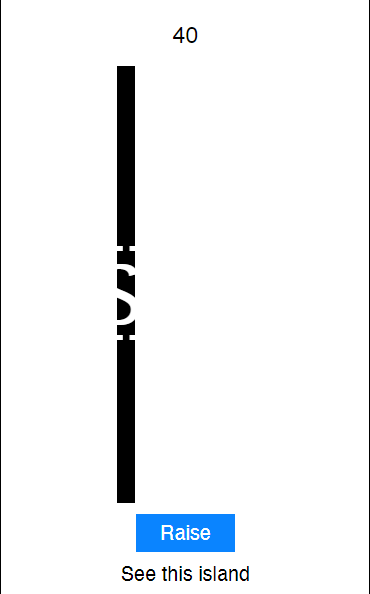
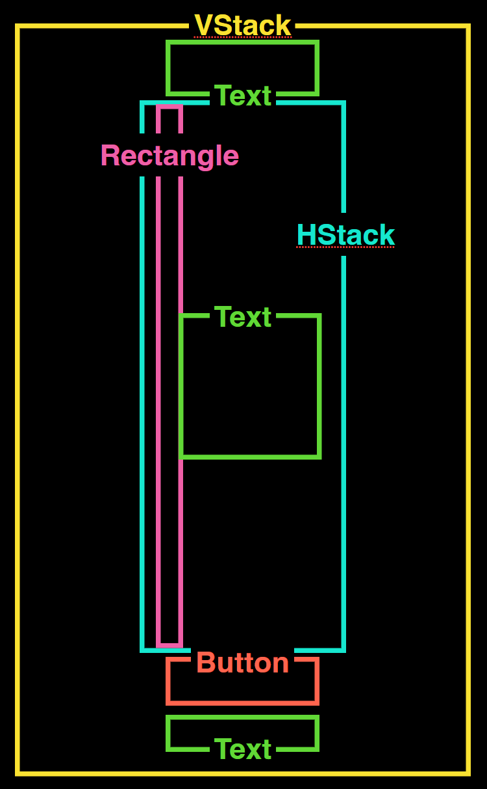

<div style="text-align: left">
    
    
</div>

## Track B: Unit 2A

# Flag Raising

Alignments and Animations

---

## Unit Overview

- Remember we used a button to increase a number, that we displayed on screen?
  - Now, we’ll tie that number to something visual — the position of a flag on a screen
- Flag Raising App
  - Laying out
  - Raising the Flag
  - Animations

---

<div style="display: flex;justify-content: center; align-items: center;">
    <div style="flex: 1;text-align: center;">    
    <h2>Demo</h2>
        <p>What we’ll make: A flag raising app. You tap on a button and the flag moves up. And up. And up. And up. And up. And up. And up. And up. And up. And up. And up. And up. And up. And up. And up.</p>
    </div>
    <div style="flex: 1;text-align: center;">
       <iframe width="500" height="900" src="./assets/flag-demo.mp4" frameborder="0" allow="accelerometer; autoplay; clipboard-write; encrypted-media; gyroscope; picture-in-picture" allowfullscreen></iframe>
    </div>
</div>

---

## What we're building

- We’ll build the famous flag raising app, as seen on Channel 8.
- Raise a flag, be patriotic.

<div style="display: flex;justify-content: center; align-items: center;">
    <div style="flex: 1;text-align: center;">    
        
    </div>
</div>

---

# Laying out Flag Raising

---vertical---

## Lets break it down

1. Duplicate the Counter
2. Rename the items from cookie-related terms to flag raising related terms
3. Add a flag pole
   1. Add a HStack.
   2. Add a Rectangle with a fixed width within the HStack. This is your flag pole.
   3. Add a Text with an emoji in the HStack `🇸🇬 🇸🇬 🇸🇬 🇸🇬 🇸🇬`

---vertical---

## Duplicate why?

- The flag raising app, at its core, is just a counter on steroids
- Why waste time rewriting all that code we’ve already written when we can just work off of what we already have?

---vertical---

## Duplicate how?

- Hold down on the **Counter** project and tap Duplicate\*\*\*\*
- Rename the duplicate from **“Counter copy”** to **“Flag Raising”**

---vertical---

## Counter → Flag Raising

- Rename our counter-related words to flag raising related ones.
- Feel free to use whatever words you like, whether it’s an National Day song or whatever.

---vertical---

```swift[]
// ContentView.swift
import SwiftUI

struct ContentView: View {

    @State var counter = 0
    @State var message = ""

    var body: some View {
        VStack {
            Text("\(counter)")

            Button {
                print("Raise Flag!!")
                counter += 1

                if counter >= 40 {
                    message = "See this island"
                } else if counter >= 30 {
                    message = "Every grain of sand"
                } else {
                    message = "Hear this anthem"
                }
            } label: {
                Text("Raise Flag")
                    .padding()
                    .background(.blue)
                    .foregroundColor(.white)
            }

            if counter >= 20 {
                Text(message)
            }
        }
    }
}

```

---vertical---

## Part 1: Run your code!

- Tap on the button in the toolbar to run the code!
- It's the same as our old cookie clicker, but with flag raising terms
- This is fairly common in programming where you copy, paste and reuse code.
- There's no point rewriting everything if the outcome is going to be similar.

---vertical---

## Part 2: Lay out your flag

<div style="display: flex;justify-content: center; align-items: center;">
    <div style="flex: 1;text-align: center;">    
        
    </div>
    <div style="flex: 1;text-align: center;">
        
    </div>
</div>

---vertical---

## Customising Stacks

`HStack(alignment: .top, spacing: 10) {}`

- With `HStack`s and `VStack`s, you can customise properties such as the spacing between elements, alignment (leading is left, trailing is right).
- For our flag, we will need to use a `HStack` to place the flag and flag pole next to one another.
  - The HStack should be aligned to the `.bottom` and with `-10` spacing. We can't possibly have the flag separated from the flag pole.

---vertical---

## Code

```swift[11-13]
// ContentView.swift
struct ContentView: View {

    @State var counter = 0
    @State var message = ""

    var body: some View {
        VStack {
            Text("\(counter)")

            HStack(alignment: .bottom, spacing: -10) {

            }

            Button {
                print("Raise flag")
                counter += 1

                if counter >= 40 {
                    message = "See this island"
                } else if counter >= 30 {
                    message = "Every grain of sand"
                } else {
                    message = "Hear this anthem"
                }
            } label: {
                Text("Raise Flag")
                    .padding()
                    .background(Color.blue)
                    .foregroundColor(.white)
            }

            if counter >= 20 {
                Text(message)
            }
        }
    }
}
```

---vertical---

## Customising Stacks

`.frame(width: 20)`

- Fix the width of a View to 20 points.
- If you want to control the height, add the `height:` parameter
- For our flag raising app, we will be fixing the width of a `Rectangle`.

---vertical---

## Rectangle

`Rectangle()`

- A rectangle that takes up as much space as possible (a filling View).
  - Views like `Text` try to take up as little space as needed (fitting Views) while Views such as Rectangle attempt to take up as much space as possible.
- Rectangle works similarly to `Circle`.
- For our flag raising app, we will use a `Rectangle` for the flag pole and constrain the `width` (using the `frame` modifier) to 30 points.

---vertical---

## Rectangle

```swift[10-13]
struct ContentView: View {

    @State var counter = 0
    @State var message = ""

    var body: some View {
        VStack {
            Text("\(counter)")

            HStack(alignment: .bottom, spacing: -10) {
                Rectangle()
                    .frame(width: 20)
            }

            Button {
                print("Raise flag")
                counter += 1

                if counter >= 40 {
                    message = "See this island"
                } else if counter >= 30 {
                    message = "Every grain of sand"
                } else {
                    message = "Hear this anthem"
                }
            } label: {
                Text("Raise Flag")
                    .padding()
                    .background(Color.blue)
                    .foregroundColor(.white)
            }
        }
    }
}
```

---vertical---

## Add a flag! `🇸🇬 🇸🇬 🇸🇬 🇸🇬 🇸🇬 🇸🇬 🇸🇬 🇸🇬`

The flag is created using a Text with the 🇸🇬 emoji and a gigantic font size.

```swift[14-16]
struct ContentView: View {

    @State var counter = 0
    @State var message = ""

    var body: some View {
        VStack {
            Text("\(counter)")

            HStack(alignment: .bottom, spacing: -10) {
                Rectangle()
                    .frame(width: 20)

                Text("🇸🇬")
                    .font(.system(size: 100))
            }

            Button {
                print("Raise flag")
                counter += 1
                 if counter >= 40 {
                    message = "See this island"
                } else if counter >= 30 {
                    message = "Every grain of sand"
                } else {
                    message = "Hear this anthem"
                }
            } label: {
                Text("Raise Flag")
                    .padding()
                    .background(Color.blue)
                    .foregroundColor(.white)
            }
            // Rest of the code remains the same
        }
    }
}
```

---vertical---

## Positioning

`.offset(x: 100, y: 200`

- Lets you move your object from where it’s supposed to be
- If you only want to move x or y, you can leave out the other parameter
- For the flag raising app, we need to use the offset to move the flag up.

---vertical---

## Co-ordinate system

- On iOS, the origin `(0, 0)` is at the top left corner.
- As such, in order for the rectangle to move up, we have to reduce the Y offset.

---vertical---

## Code


---vertical---

## Run your code!

<div style="display:flex;" >
<div style="flex:1;">

- The flag raises!!
- The flag moves!!!
- It’s alive!!!!!!!!!!!!

</div>
<div style="flex:1;">
<video controls>
  <source src="./assets/flag-without-animations.mp4" type="video/mp4">
  Your browser does not support the video tag.
</video>
</div>
</div>

---

# Using `withAnimation`s?

---vertical---

## What do we want?

- Instead of the flag jumping, can we have it nicely animate up?
- When the text appears, it jumps everything
- Just have smooth animations
- Now when something changes, it jumps awkwardly.

---vertical---

## Animations

`withAnimation {}`

- Animate a @State variable change!
- If the variable is mutated within the curly braces of withAnimation, the state change will be animated nicely
- Yup that's it. It's that simple.

---vertical---

## Code

- Embed the `Button`'s action into the `withAnimation` block and you're done!

```swift[8-18]
// ContentView.swift

...

Button {
    print("Raise flag")

    withAnimation {
        counter += 1

        if counter >= 40 {
            message = "See this island"
        } else if counter >= 30 {
            message = "Every grain of sand"
        } else {
            message = "Hear this anthem"
        }
    }
} label: {
    Text("Raise Flag")
        .padding()
        .background(Color.blue)
        .foregroundColor(.white)
}

...
```

---vertical---

## Run your code _again_!

<div style="display:flex;" >
<div style="flex:1;">

- Such smooth animations
- 5 stars on the App Store
- ❤️ ❤️ ❤️ ❤️ ❤️
- ⭐️ ⭐️ ⭐️ ⭐️ ⭐️
- 🤩 🤩 🤩 🤩 🤩
- 🌟 🌟 🌟 🌟 🌟

</div>
<div style="flex:1;">
<video controls>
  <source src="./assets/flag-final-demo.mp4" type="video/mp4">
  Your browser does not support the video tag.
</video>
</div>
</div>

---

## Flag Raising Code

<p> ContentView.swift</p>

```swift[]
import SwiftUI

struct ContentView: View {

    @State var counter = 0
    @State var message = ""

    var body: some View {
        VStack {
            Text("\(counter)")

            HStack(alignment: .bottom, spacing: -10) {
                Rectangle()
                    .frame(width: 20)

                Text("🇸🇬")
                    .font(.system(size: 100))
                    .offset(y: -10 * CGFloat(counter))
            }

            Button {
                print("Raise Flag!!")

                withAnimation {
                    counter += 1

                    if counter >= 40 {
                        message = "See this island"
                    } else if counter >= 30 {
                        message = "Every grain of sand"
                    } else {
                        message = "Hear this anthem"
                    }
                }
            } label: {
                Text("Raise Flag")
                    .padding()
                    .background(.blue)
                    .foregroundColor(.white)
            }

            if counter >= 20 {
                Text(message)
            }
        }
    }
}
```

---

# Extension

---vertical---

## Example Other Clickers

### This concept extends beyond just increasing a counter and raising a flag… you can change a whole bunch of properties using state variables! Here are some examples.


---vertical---

<video width="500" controls>
  <source  src="./assets/flag-example0.mov" type="video/mp4">
  Your browser does not support the video tag.
</video>

---vertical---

<video width="500" controls>
  <source  src="./assets/flag-example1.mp4" type="video/mp4">
  Your browser does not support the video tag.
</video>

---vertical---

<video width="500" controls>
  <source  src="./assets/flag-example2.mov" type="video/mp4">
  Your browser does not support the video tag.
</video>

---vertical---

<video width="500" controls>
  <source  src="./assets/flag-example3.mp4" type="video/mp4">
  Your browser does not support the video tag.
</video>

---vertical---

<video width="500" controls>
  <source  src="./assets/flag-example4.mov" type="video/mp4">
  Your browser does not support the video tag.
</video>

---vertical---

<video width="500" controls>
  <source  src="./assets/flag-example5.mov" type="video/mp4">
  Your browser does not support the video tag.
</video>

---

# And that's it!

---

###  Flag Raising App

# Full Code

[Download Completed Project](https://github.com/tinkercademy/swift-demo-projects/raw/main/Flag%20Raising.zip/)
