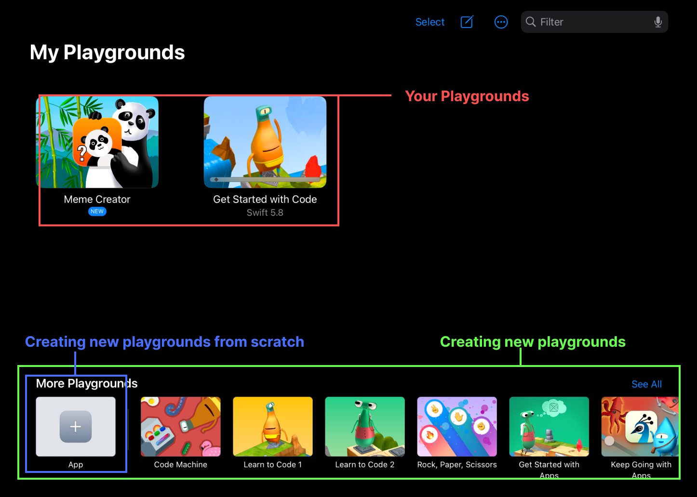
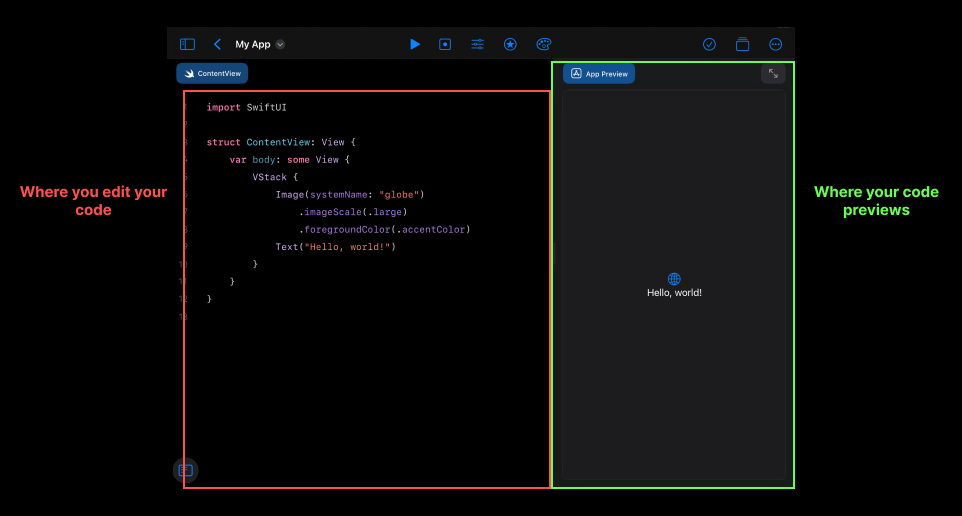
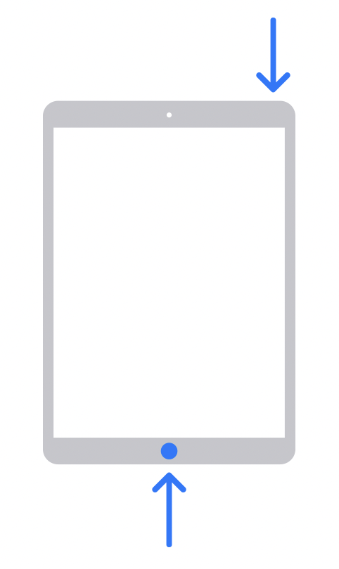

    
    

## Track B : Unit 0

# iPad and Swift Playgrounds

---

## What is Swift?

- Swift is an open-source programming language created by Apple
- Used by developers to build apps for iOS, iPadOS, macOS, watchOS, tvOS, and more.

---

# Introduction to Swift Playgrounds

---vertical---

## Getting Started

### 🚀 Swift Playgrounds for iPad

---vertical---

##  Swift Playgrounds

### _Swift Playgrounds_ helps you learn to code and build apps using Swift, the same powerful language used to create world-class apps for the App Store.

[Swift Playgrounds on the App Store](https://apps.apple.com/app/id908519492).

---vertical---

## Swift Playgrounds

---vertical---

## Learning with Swift Playgrounds

    <ul>
        <li>Swift Playgrounds offers interactive tutorials that teach Swift Fundamentals as SwiftUI elements</li>
        <li>Can be accessed by clicking <code>See All</code> in More Playgrounds</li>
    </ul>
    

---vertical---

## App mode

#### Mainly used when you want to create an App with SwiftUI

---vertical---

## Playgrounds mode

#### Mainly used for running Swift code that does not require SwiftUI

---

# Screen Capturing

---vertical---

## Taking a Screenshot

    <ul style="width:60%">
        <li>Every lesson, we’ll ask you to export a screenshot, so it’s easier for us to take a look without having to connect to (and mess up) your iCloud version.</li>
        <li>Press the home and power buttons at the same time to take a screenshot. </li>
        <li>With Apple Pencil, you can also draw in from the bottom left..</li>
    </ul>
    

---vertical---

## Recording your Screen

    <ul style="width:60%">
        <li>First, ensure that the Screen Recording setting in Control Center is enabled</li>
            <ul>
                <li>Go to Settings → Control Center, then tap the Add Button  next to Screen Recording</li>
            </ul>
        <li>Open the Control Center by swiping down from the top-right of the screen</li>
        </li>
            Tap the Record Button, wait for the three-second countdown. Then, tap it again to stop the recording
        </li>
    </ul>
     

