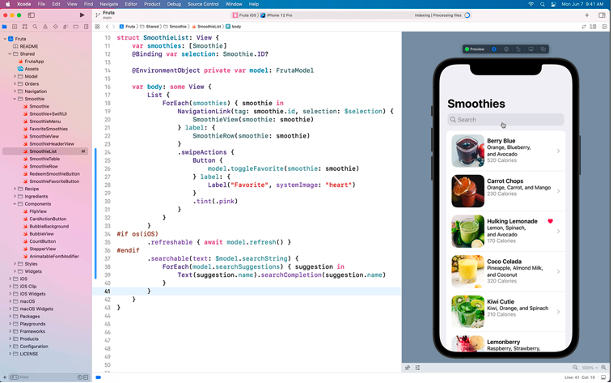

    
    

## Track B : Unit 1

# Intro to Swift Playgrounds

---

# What is Swift

---vertical---

## What is Swift?

- Swift is an open-source programming language created by Apple
- Used by developers to build apps for iOS, iPadOS, macOS, watchOS, tvOS, and more.

---

# Introduction to Swift Playgrounds

---vertical---

## Getting started

    <ul>
        <li>Open the Swift Playgrounds app on your iPad</li>
        <li>Under “Get a Playground”, tap on “Get Started with Code”</li>
    </ul>
    

        
    

