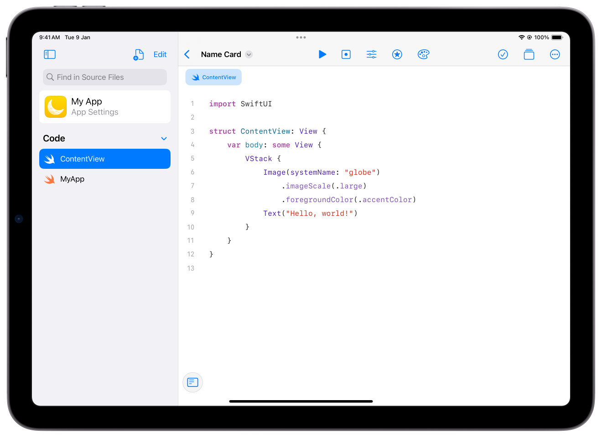
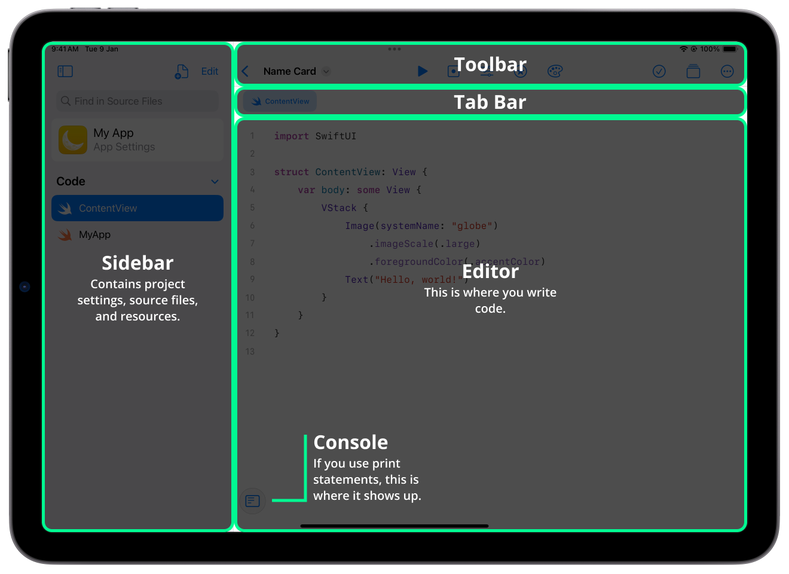
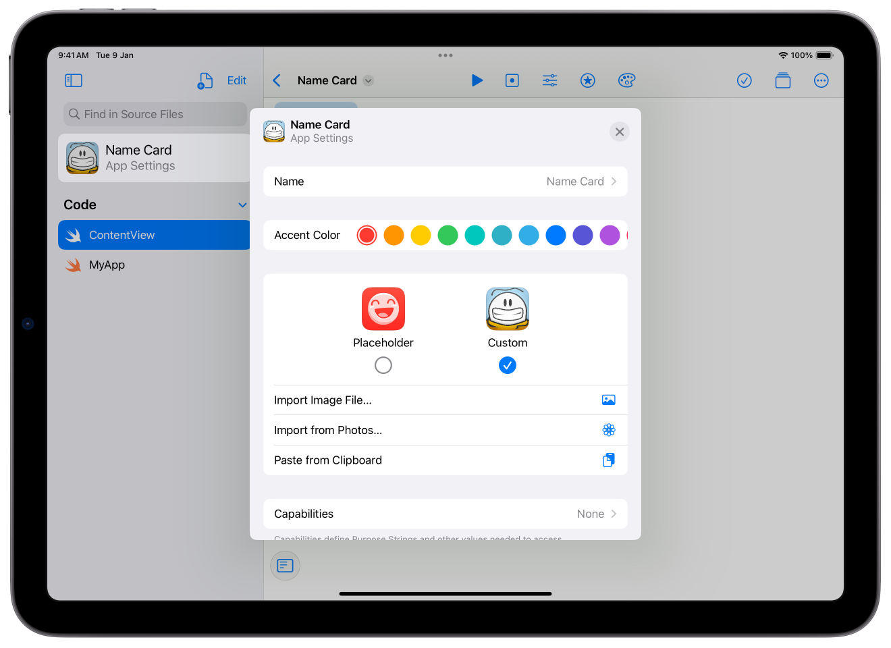
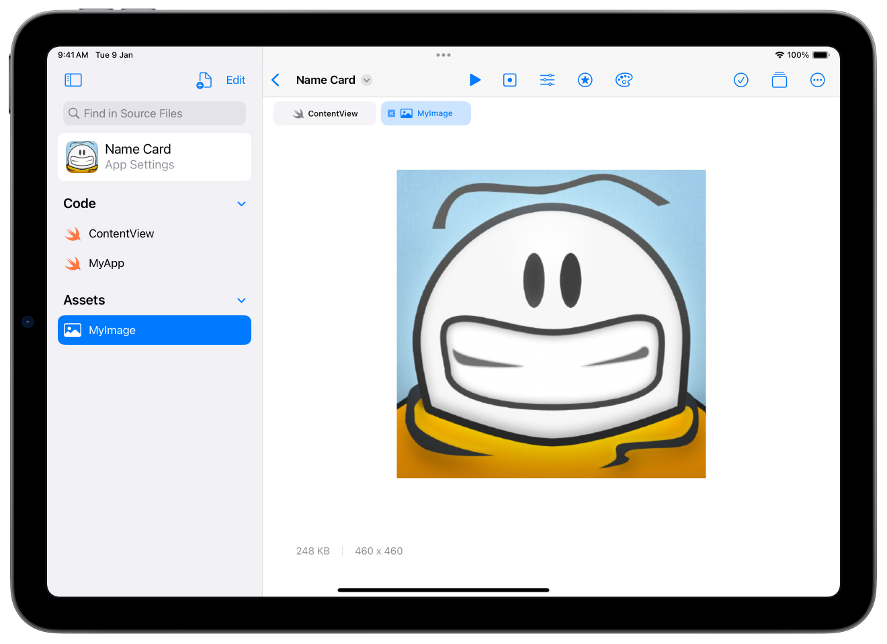
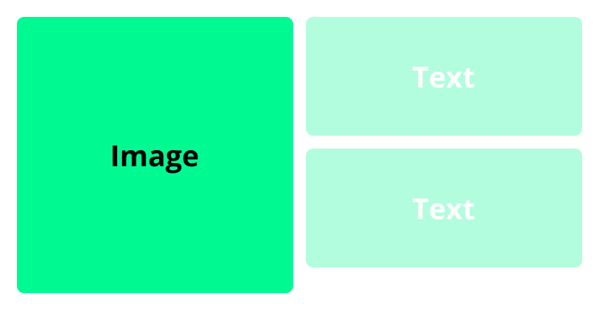
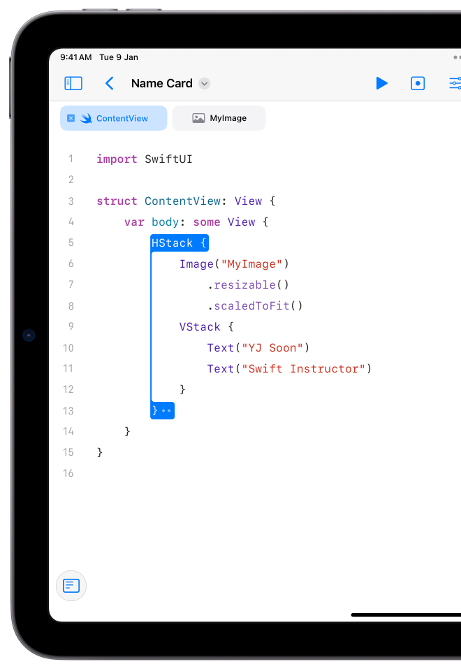
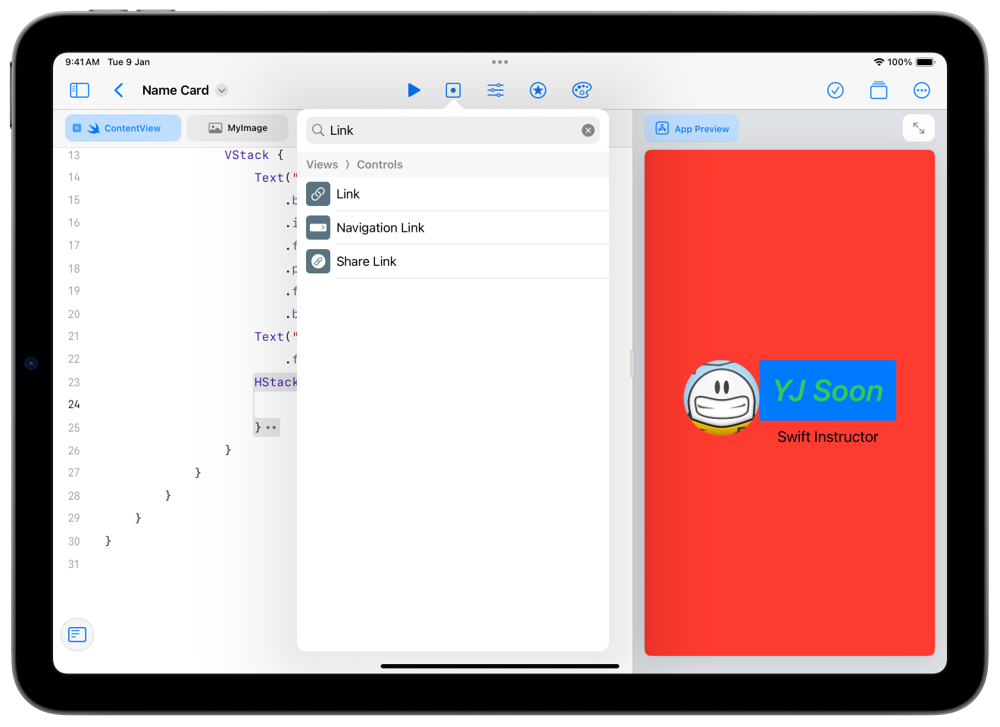

<div style="text-align: left">
    
    
</div>

## Track B: Project 1
# Name Card

Create a name card app in Swift Playgrounds.

---

## Unit Overview
- [Getting started with Playgrounds](#getting-started)
- [Introduction to SwiftUI](#swiftui)
    - [Texts](#text) • [Images](#image) • [View Modifiers](#view-modifiers) • [Layouts](#layout-with-stacks)
- [More Modifiers](#more-modifiers)
    - [Text Modifiers](#text-modifiers) • [Colours & Padding](#colours--padding) • [Sizing](#sizing) • [Masking](#masking) • [Clip Shapes](#clip-shapes)
- [Links & SF Symbols](#links--sf-symbols)
- [Tips & Tricks](#tips--tricks)

---
# Getting Started
## 🚀 Swift Playgrounds for iPad

---vertical---

##  Swift Playgrounds
### _Swift Playgrounds_ helps you learn to code and build apps using Swift, the same powerful language used to create world-class apps for the App Store.

[Swift Playgrounds on the App Store](https://apps.apple.com/app/id908519492).

---vertical---

## Create a Playground App
<div style="display: flex; ">
    <ol>
        <li>Press the  icon to create a new App</li>
        <li>Hold down on the newly created app and tap <strong>Rename</strong></li>
        <li>Name it <strong>“Name Card”</strong></li>
        <li>Tap on the app to open it</li>
    </ol>
    
</div>

---vertical---

<div style="display:flex;justify-content:center;align-items:center;">
    
</div>

---vertical---

<div style="display:flex;justify-content:center;align-items:center;">
    
</div>

---vertical---

## What’s in the toolbar

<div style="display:flex;justify-content:center;align-items:center;">
    
</div>

---vertical---

## Configuring Your Project

<div style="display: flex; ">
    <ol>
        <li>Open the Sidebar</li>
        <li>Select App Settings</li>
        <li>Make sure our app’s name is “Name card”</li>
        <li>Select your favourite colour as your <em>Accent Color</em>.</li>
    </ol>
    
    
</div>


---vertical---


## Setting an App Icon
<div style="display: flex; ">
    <ol>
        <li>Open iPad’s Camera app</li>
        <li>Take a selfie!</li>
        <li>Back in Playgrounds,
            <ol>
                <li>Select Custom App Icon</li>
                <li>Choose from Photos</li>
                <li>Add the image you just took</li>
            </ol>
        </li>
        <li>You’re now an app icon!</li>
    </ol>
    
</div>

---

# SwiftUI
### _SwiftUI_ is Apple's newest toolkit for building apps on Apple platforms such as iOS, iPadOS, macOS, visionOS, and more. 

### We create user interfaces using `View`s such as `Text`, `Image`, and `Stack`s.

[Apple Developer Documentation](https://developer.apple.com/documentation/swiftui)

---vertical---

## Text
- In the starter code, look for this line of `Text`: 
```swift
Text("Hello, world")
```
- Change the words in the string — that's the text inside the double quotes — to your name! 
```swift
Text("YJ Soon")
```
- Run, and it’ll be reflected in the app. 
- You can add more text underneath the existing one! Perhaps add what you do. For me, that’s 
```swift
Text("Swift instructor")
```

---vertical---

```swift[9-10]
import SwiftUI

struct ContentView: View {
    var body: some View {
        VStack {
            Image(systemName: "globe")
                .imageScale(.large)
                .foregroundColor(.accentColor)
            Text("YJ Soon")
            Text("Swift Instructor")
        }
    }
}
```

 ContentView.swift

---vertical---

## Image
- A name card needs an image. 
- We’ll take a photo of ourselves, and put it into our app!
- To do this, we’ll use a `View` called `Image`. You would have already seen an example right above the `Text`.
  - In Playgrounds, we can take a photo, and show it on-screen using the `Image` view below. Add the photo’s name in the quotes.
  ```swift
   Image("MyImageName")
  ```
  - This is just like the `Text`s we saw! 

---vertical---

## Importing Images

<div style="display: flex; ">
    <ol>
        <li>Open the Sidebar </li>
        <li>Tap on the Add File button </li>
        <li>Select Photo</li>
        <li>Select a photo from your Photos!</li>
        <li>You’ll see your image in the <strong>Assets</strong> section</li>
        <li>Hold down on its name and select <strong>Rename</strong></li>
        <li>Name it <strong>MyImage</strong>.</li>
    </ol>
    
</div>

---vertical---

## Adding Your Image

<div style="display: flex; ">
    
    <ol>
        <li>Replace the  <code>Image</code> provided with your own image!</li>
        <li>
        Change
        <pre><code class="hljs language-swift" data-line-numbers data-ln-start-from="6">Image(systemName: "globe")
    .imageScale(.large)
    .foregroundColor(.accentColor)</code></pre>
        to
        <pre><code class="hljs language-swift" data-line-numbers data-ln-start-from="6">Image("MyImage")</code></pre>
        this will make sure that your image shows up on screen.
        </li>
        <li>Get a heart attack because your face now looks gigantic</li>
        <li>Add the <code>.resizable()</code> modifier and <code>.scaledToFit()</code> modifiers to fix this.</li>
    </ol>
</div>

---vertical---

## View Modifiers
- SwiftUI has hundreds of different modifiers that we can use to make our individual Views look better, we can add View Modifiers (or just modifiers).
- These are additional pieces of formatting and functionality “tacked on” to each View. 
- To add a modifier, add it to the end of a View, like this: `.modifierName()`
- We’ll introduce a variety of modifiers, and add them to various elements, to help enhance our app. 

---vertical---
```swift[3:4-6]
struct ContentView: View {
    var body: some View {
        VStack {
            Image("MyImage")
                .resizable()
                .scaledToFit()
            Text("YJ Soon")
            Text("Swift Instructor")
        }
    }
}
```
 ContentView.swift

---vertical---

## Layout with Stacks
- In SwiftUI, our UI is reflected directly in our code 
    - This means the first thing on the screen is often the first thing shown, at the top, then going down
- What if we want to lay things out horizontally, or back-to-front? Introducing three different stacks:
    - `VStack`, for vertical stacking
    - `HStack`, for horizontal stacking
    - `ZStack`, for back-to-front stacking, also known as _Depth Stack_.

---vertical---

## `VStack`
<div style="display: flex; ">
    <ul>
        <li>We’ve seen it already! There was one provided free for us when we created our app.</li>
        <li>If you are arranging items vertically, you’ll need a <code>VStack</code>.</li>
    </ul>
    
</div>

---vertical---

```swift[3:3,9]
struct ContentView: View {
    var body: some View {
        VStack {
            Image("MyImage")
                .resizable()
                .scaledToFit()
            Text("YJ Soon")
            Text("Swift Instructor")
        }
    }
}
```
 ContentView.swift

---vertical---

## `HStack`
<div style="display: flex; ">
    <ul>
        <li>We want our image to be on the left of the two pieces of text.</li>
        <li>To do this, we can use a <code>HStack</code>, containing two <code>View</code>s:
            <ul>
                <li>The <code>Image</code> itself, on the left</li>
                <li>The <code>VStack</code>, on the right.</li>
            </ul>
        </li>
    </ul>
    
</div>

---vertical---

```swift[3:3,7,10,11]
struct ContentView: View {
    var body: some View {
        HStack {
            Image("MyImage")
                .resizable()
                .scaledToFit()
            VStack {
                Text("YJ Soon")
                Text("Swift Instructor")
            }
        }
    }
}
```

 ContentView.swift

---vertical---
<div style="display: flex; ">
    <div>
        <h2>What’s in what?</h2>
        <ul>
            <li>We’ve started nesting <code>HStack</code>s in <code>VStack</code>s and this can quickly get confusing trying to figure out what belongs in which stack view.
            </li>
            <li>You can tap on ether the <code>{</code> or <code>}</code> to get the entire area highlighted.</li>
        </ul>
    </div>
    
</div>

---vertical---

## HStack Parameters
- What if we want our image and our text to be nicely aligned at the top? 
- We can introduce parameters to our `HStack` — the way we did for `Image`, but before the curly braces.
- The parameter in question is called `alignment:`, and it can be `.top`, `.center`, `.bottom`.
    - The dots are because of something called enumerations (enums), which we’ll talk about in the future. 
- There’s another parameter, called `spacing:`, which takes a number. Try it out if you have a chance!

---vertical---

```swift[3:3]
struct ContentView: View {
    var body: some View {
        HStack(alignment: .top) {
            Image("MyImage")
                .resizable()
                .scaledToFit()
            VStack {
                Text("YJ Soon")
                Text("Swift Instructor")
            }
        }
    }
}
```
 ContentView.swift


---vertical---

## `ZStack` — Depth Stack

- Let’s add some background colour to our app. 
- A background colour will, naturally, go behind the `View`s. 
- In SwiftUI, a background colour is a View, that goes behind other Views, using a `ZStack`. 
- The `Color`<subscript>*</subscript> View has a few built-in options you can use, such as <code style="color: #0A84FF">.blue</code>, <code style="color: #FF453A">.red</code>, <code style="color: #FFD60A">.yellow</code>, <code style="color: #30D158">.green</code>. Try them out!

<small style="text-align: left; width:100%; margin-top: 64px"><subscript>*</subscript> 🇺🇸 American spelling, because <em>Designed by Apple in California</em> and all that.</small>

---vertical---

```swift[3:3-4,14]
struct ContentView: View {
    var body: some View {
        ZStack {
            Color.red
            HStack(alignment: .top) {
                Image("MyImage")
                    .resizable()
                    .scaledToFit()
                VStack {
                    Text("YJ Soon")
                    Text("Swift Instructor")
                }
            }
        }
    }
}
```
 ContentView.swift

---

# More Modifiers
## or moredifiers…

---vertical---

## View Modifiers
- To make our individual Views look better, we can add View Modifiers (or just modifiers).
- These are additional pieces of formatting and functionality “tacked on” to each View. 
- We’ll introduce a variety of modifiers, and add them to various elements, to help enhance our app. 

---vertical---

## Text Modifiers

- Make `Text` **bold**.
```swift
.bold()
```

- Make `Text` *italic*.
```swift
.italic()
```

- Changes `Text` font size to <span style="font-size: 100px">100</span>.
```swift
.font(.system(size: 100))
```

---vertical---

```swift[3:11-13,15]
struct ContentView: View {
    var body: some View {
        ZStack {
            Color.red
            HStack(alignment: .top) {
                Image("MyImage")
                    .resizable()
                    .scaledToFit()
                VStack {
                    Text("YJ Soon")
                        .bold()
                        .italic()
                        .font(.system(size: 40))
                    Text("Swift Instructor")
                        .font(.system(size: 20))
                }
            }
        }
    }
}
```
 ContentView.swift

---vertical---

## Colours & Padding

- Makes the foreground style (e.g. `Text`/symbol colour) <span style="color: #0A84FF">blue</span>.
```swift
.foregroundStyle(.blue)
```

- Make the background of any `View` <span style="background: #FF453A">red</span>.
```swift
.background(.red)
```

- Gives some space to any View.
```swift
.padding()
```
You can also include a number, to define how much padding to give

    _Note that order matters — if you add padding <span style="background: #FF453A; padding: 16px">before a background</span>, your padding will also receive that background._

---vertical---

```swift[3:14-16]
struct ContentView: View {
    var body: some View {
        ZStack {
            Color.red
            HStack(alignment: .top) {
                Image("MyImage")
                    .resizable()
                    .scaledToFit()
                VStack {
                    Text("YJ Soon")
                        .bold()
                        .italic()
                        .font(.system(size: 40))
                        .padding()
                        .foregroundStyle(.green)
                        .background(.blue)
                    Text("Swift Instructor")
                        .font(.system(size: 20))
                }
            }
        }
    }
}
```
 ContentView.swift

---vertical---

## Sizing
```swift
.frame(width: 100, height: 100)
```

- Adjust the size of a `View`. Both parameters are optional, play around to see which parameter(s) may need to size your image.
- This will be great for our images to ensure it has a decent size.
- **Important:** While this modifier can be used to easily layout your views, you should use `VStack`s and `HStack`s instead as it - allows your views to easily scale, especially since our apps should work on screens no matter the size.

---vertical---

```swift[3:9]
struct ContentView: View {
    var body: some View {
        ZStack {
            Color.red
            HStack(alignment: .top) {
                Image("MyImage")
                    .resizable()
                    .scaledToFit()
                    .frame(width: 100)
                VStack {
                    Text("YJ Soon")
                        .bold()
                        .italic()
                        .font(.system(size: 40))
                        .padding()
                        .foregroundStyle(.green)
                        .background(.blue)
                    Text("Swift Instructor")
                        .font(.system(size: 20))
                }
            }
        }
    }
}
```
 ContentView.swift

---vertical---

## Masking
- Mask or crop content behind the `View` given as a parameter (in curly braces).
```swift
.mask { Circle() }
```
- Try adding `Text` as a parameter, to see how an image shows up when masked by text. 
    ```swift
    .mask {
        Text("Hello")
            .font(.system(size: 250))
    }
    ```
- You can also use an SF Symbols icons as a mask.
    ```swift
    .mask { 
        Image(systemName: "star.fill")
            .font(.system(size: 250))
    }
    ```

---vertical---

## Clip Shapes
- Clips a view by a shape. In this case, it will be clipped by a circle.
```swift
.clipShape(Circle())
```
- You can also use `RoundedRectangle` to get rounded corner.
```swift
.clipShape(RoundedRectangle(cornerRadius: 16))
```

---vertical---

```swift[3:10]
struct ContentView: View {
    var body: some View {
        ZStack {
            Color.red
            HStack(alignment: .top) {
                Image("MyImage")
                    .resizable()
                    .scaledToFit()
                    .frame(width: 100)
                    .clipShape(Circle())
                VStack {
                    Text("YJ Soon")
                        .bold()
                        .italic()
                        .font(.system(size: 40))
                        .padding()
                        .foregroundStyle(.green)
                        .background(.blue)
                    Text("Swift Instructor")
                        .font(.system(size: 20))
                }
            }
        }
    }
}
```
 ContentView.swift

---

# Links & SF Symbols
## 🔗 Open URLs in your app!

---vertical---

## Set Up

<div style="display: flex;">
    <ul>
        <li>We’ll create some tappable icons in a <code>HStack</code> for users of our app to find out more about us.</li>
        <li>Within the <code>VStack</code>, create an empty <code>HStack</code>. It will be populated with our <code>Link</code>s later.</li>
    </ul>
    
</div>

---vertical---

##  Adding a Link

<div style="display: flex; ">
    <ol>
        <li>Tap on the space within the <code>HStack</code> to create an insertion point</li>
        <li>In the toolbar, select  to open the <em>Views Library</em></li>
        <li>Search and select <strong>” Link”</strong></li>
    </ol>
    
</div>

---vertical---

## Setting the `Link` Destination

1. Tap on the <code style="background: #007AFF; padding: 4px; border-radius: 4px; color: white;">URL</code> placeholder
2. Replace it with the following
```swift
URL(string: "https://apple.com")!
```
    Feel free to change the link from [apple.com](https://apple.com) to something else.

    - Use `https://` to link to a website: `https://swiftinsg.org`
    - Use `mailto:` to add an email address: `mailto:hello@swiftinsg.org`
    - If you're interested, you can read [this awfully technical document](https://www.rfc-editor.org/rfc/rfc7595.html) on URI schemes.

---vertical---

##  Adding SF Symbols

<div style="display: flex; ">
    <ol>
        <li>Tap on the <code style="background: #007AFF; padding: 4px; border-radius: 4px; color: white;">Text("Link")</code> placeholder</li>
        <li>In the toolbar, select  to open the <em>Symbols Library</em></li>
        <li>Browse through hundreds of beautifully designed icons that you can use within your apps</li>
        <li>When you’ve found one you like, select it and it will automatically add itself into your code.</li>
        <li>After you're done, add more links!</li>
        <li>Use modifiers you learnt earlier to customise them!</li>
    </ol>
    
</div>

---vertical---
```swift[3:21-28]
struct ContentView: View {
    var body: some View {
        ZStack {
            Color.red
            HStack(alignment: .top) {
                Image("MyImage")
                    .resizable()
                    .scaledToFit()
                    .frame(width: 100)
                    .clipShape(Circle())
                VStack {
                    Text("YJ Soon")
                        .bold()
                        .italic()
                        .font(.system(size: 40))
                        .padding()
                        .foregroundStyle(.green)
                        .background(.blue)
                    Text("Swift Instructor")
                        .font(.system(size: 20))
                    HStack {
                        Link(destination: URL(string: "mailto:hello@tk.sg")!) {
                            Image(systemName: "mail")
                        }
                        Link(destination: URL(string: "https://tk.sg/importantLink")!) {
                            Image(systemName: "pc")
                        }
                    }
                    .font(.system(size: 20))
                    .foregroundStyle(.yellow)
                    .padding(.top)
                }
            }
        }
    }
}
```
 ContentView.swift

---

### 🪪 Name Card App
# Full Code

[Download Completed Project](https://github.com/tinkercademy/swift-demo-projects/raw/main/Name%20Card.zip/)

---vertical---

##  ContentView
```swift[1:]
import SwiftUI

struct ContentView: View {
    var body: some View {
        ZStack {
            Color.red
            HStack(alignment: .top) {
                Image("MyImage")
                    .resizable()
                    .scaledToFit()
                    .frame(width: 100)
                    .clipShape(Circle())
                VStack {
                    Text("YJ Soon")
                        .bold()
                        .italic()
                        .font(.system(size: 40))
                        .padding()
                        .foregroundStyle(.green)
                        .background(.blue)
                    Text("Swift Instructor")
                        .font(.system(size: 20))
                    HStack {
                        Link(destination: URL(string: "mailto:hello@tk.sg")!) {
                            Image(systemName: "mail")
                        }
                        Link(destination: URL(string: "https://tk.sg/importantLink")!) {
                            Image(systemName: "pc")
                        }
                    }
                    .font(.system(size: 20))
                    .foregroundStyle(.yellow)
                    .padding(.top)
                }
            }
        }
    }
}
```

---

# Tips & Tricks
## Be a better developer, or at least look the part.

---vertical---

## Dark mode vs. Light mode
- On Playgrounds, your app looks different in dark mode and light mode!
    - Switch between the two in your Control Center to see how it looks
    - Hold down on the brightness slider and then tap Dark Mode.
    - To find out more, refer to [this article](https://support.apple.com/en-us/HT210332) by Apple.

---vertical---

## A Note on `View`s Taking Up Space
- You may have noticed that some `View`s behave differently with respect to the space around them, e.g. an `Image` with and without `.resizable()`
- Views behave one way or the other: 
    - Fit: These Views exercise a lot 💪 take up only as much space as their contents need. 
        - Fitting Views include `Text`, `Image`, and all three `Stack`s. 
        - You can make them fill by using the `.frame` modifier with `maxWidth: .infinity` or `maxHeight: .infinity`
    - Fill: These Views take up as much space as they can, like someone stretching out on a bed. 
        - Filling Views include `Color`, `Image.resizable()`, and all shapes (`Circle`, `RoundedRectangle`, etc.)
        - You can size them down using the `.frame` modifier with a fixed `width` and/or `height`.

---vertical---

## SF Symbols variations
- Adding `.fill` behind the name of some SF Symbols icons can give you a filled-in version of the icon. Try this with `star` and `star.fill`.
- Some icons have multiple colours!
- You can see these in the Multicolour section in the _Symbols Library_.
- To show icons with colour, before any foregroundStyle modifier, use the `.renderingMode(.original)` modifier
```swift
Image(systemName: "sunrise.fill")
    .renderingMode(.original)
```

---vertical---

## Curly Braces
- With lots of curly braces, it can be hard to see where to add a modifier or put the next View
- Here are two ways to identify a block (pair of curly braces):
    - Move your cursor on or around each curly brace to see its corresponding matched pair
    - Double-click on each curly brace to highlight the entire block
- You can also drag a handle on the last curly brace `}` to “extend” it downwards, e.g. when creating a `VStack` above a `View` you want to include

---vertical---

## Indentation
```txt
Is your code indented properly?
    Poorly indented 
        Code
                            can be very
hard to read
```
- Playgrounds is quite strict about indentation — the app will make sure `View`s that are within other `View`s are one “level” deeper in indentation
- If anything goes wrong, let Playgrounds auto-fix it for you
    - Select all your code with `Command`-`A` (`⌘A`), or Edit → Select All
    - Re-Indent all your code automatically with `Control`-`I` (`^I`), or Edit → Re-Indent
