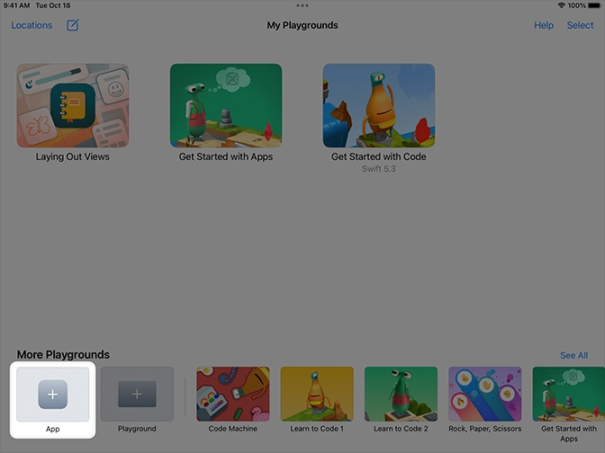
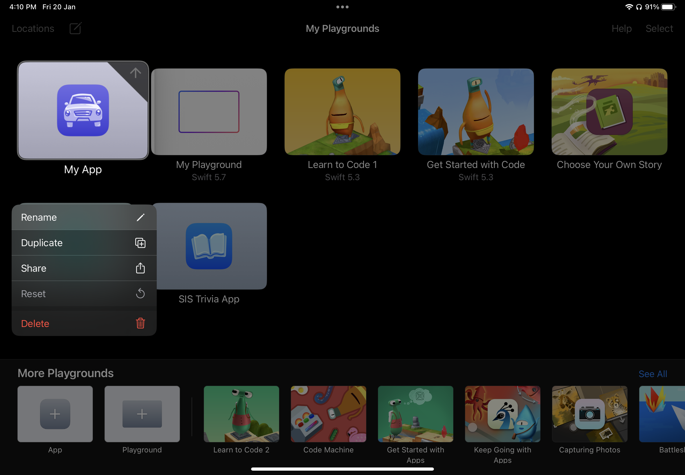
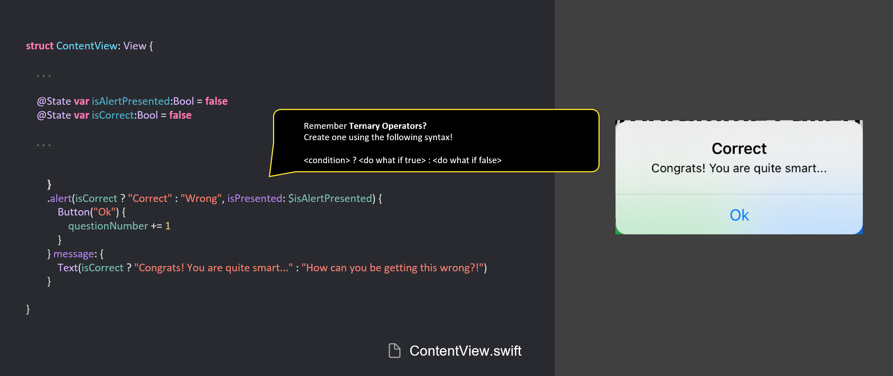
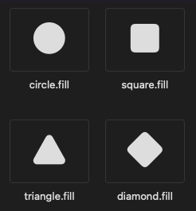
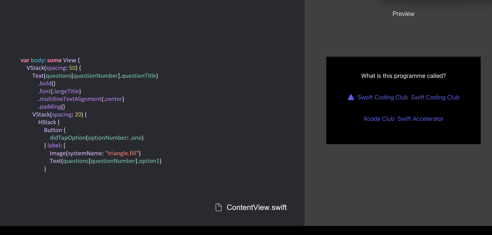
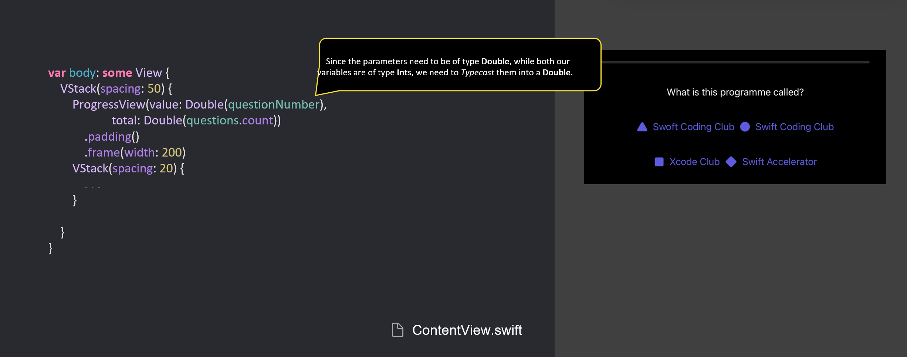
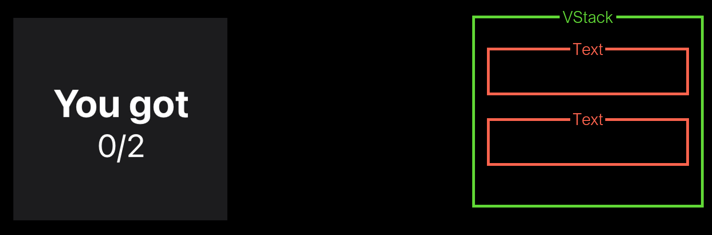
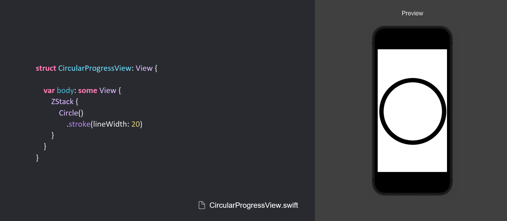
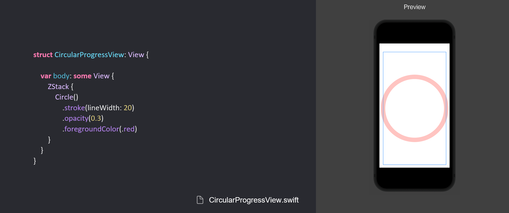
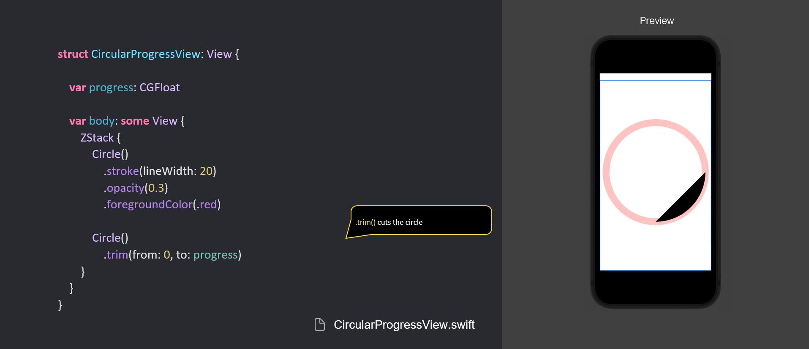

<div style="text-align: left">
    
    
</div>

## Track B: Quit 4B

# Exploration Project: Quiz App

What we’ll make: Well, a quiz app. There will be a few options, where you have to choose the correct answer. A circular score view will be displayed to you when the quiz is over.

---

# Quiz App

---vertical---

<div style="display: flex; ">

<div style="flex:1;">

<h2> Project Preparation </h2>

- Create a new ‘App’ in Swift Playgrounds
- Rename it to ‘Quiz App’

</div>

<div style="flex:1; display: flex; flex-direction: column;">




</div>

</div>

---

# UI Prep

## A walk-through on creating the quiz app

---vertical---

## Creating the User Interface


---vertical---

## Creating the User Interface

<p> ContentView.swift</p>

```swift
struct ContentView: View {
    var body: some View {
        VStack {
            Text("Question!")
                .padding()
            VStack {
                HStack {
                    Button {

                    } label: {
                        Text("Option 1")
                    }

                    Button {

                    } label: {
                        Text("Option 2")
                    }
                }
                .padding()
                HStack {
                    Button {

                    } label: {
                        Text("Option 3")
                    }

                    Button {

                    } label: {
                        Text("Option 4")
                    }
                }
                .padding()
            }
        }
        .padding()
    }
}
```

---vertical---

## Creating Questions

- To create the variable of `correctOption`, we can use **Enums** in place of the number of the correct option
- This ensures that the option will always exist, and we can’t put the wrong number in our code (e.g. making a typo, and comparing against 5)

```swift
enum OptionChoice {
    case one, two, three, four
}

```

<p> Question.swift</p>

---vertical---

## Creating Questions

- We can create questions by creating a **Struct** called `Question`
- We can use the **Enum**, `OptionChoice`, that we just created to represent the `correctOption`

```swift
struct Question {
    var questionTitle: String

    var option1: String
    var option2: String
    var option3: String
    var option4: String

    var correctOption: OptionChoice
}
```

<p> Question.swift</p>

---vertical---

## Creating Questions

- Inside ContentView.swift, we can declare an **Array** `questions` of **Struct** `Question`

```swift
struct ContentView: View {

    let questions = [
        Question(questionTitle: "What is this programme called?",
                                    option1: "Swoft Coding Club",
                                    option2: "Swift Coding Club",
                                    option3: "Xcode Club",
                                    option4: "Swift Accelerator",
                                    correctOption: .two),
        Question(questionTitle: "What language are we using?",
                                    option1: "Xcode",
                                    option2: "Python",
                                    option3: "SwiftUI",
                                    option4: "Swift",
                                    correctOption: .four)
    ]
// more code here
```

<p> ContentView.swift</p>

---vertical---

## Changing question numbers

- Currently, we cannot change questions
- In order to do this, we can create a @State variable to keep track of the question number, then get the question corresponding to that number

---vertical---

<p> ContentView.swift</p>

```swift
struct ContentView: View {

    let questions = [
        Question(questionTitle: "What is this programme called?", option1: "Swoft Accelerator", option2: "Swift Accelerator", option3: "Xcode Accelerator", option4: "Python Accelerator", correctOption: .two),
        Question(questionTitle: "What language are we using?", option1: "Xcode", option2: "Python", option3: "SwiftUI", option4: "Swift", correctOption: .four)
    ]

    @State var questionNumber: Int = 0

    var body: some View {
        VStack {
            Text(questions[questionNumber].questionTitle)
                .padding()
            VStack {
                HStack {
                    Button { } label: {
                        Text(questions[questionNumber].option1)

                    }

                    Button { } label: {
                        Text(questions[questionNumber].option2)
                    }
                }
                .padding()
                HStack {
                    Button { } label: {
                        Text(questions[questionNumber].option3)
                    }

                    Button { } label: {
                        Text(questions[questionNumber].option4)
                    }
                }
// more code goes here
```

---

# Presenting an alert

- Every time an option is clicked, let’s present an alert to tell the user if their answer is correct or wrong

---vertical---

## Presenting an alert

`.alert {}`

- Parameters: title, isPresented
  - A new `@State` variable should be created to record the boolean value of isPresented
  - When `isPresented` is true, the alert will be presented to the user
- Should be a modifier of the main VStack/HStack/ZStack
- We will also create another `@State` variable to check if the user’s answer is correct

---vertical---

## Creating the Alert



---vertical---

## Handling button presses

- Now that we have an `alert` to show the result of the question, how do we present it to the user when an option is clicked?
- We can create a `function`, and call it with the option number when the button is clicked!

```swift
func didTapOption(optionNumber: OptionChoice) {
    if optionNumber == questions[questionNumber].correctOption {
        isCorrect = true
        print("Correct option!")
    } else {
        isCorrect = false
        print("Wrong option!")
    }
    isAlertPresented = true
}
```

<p> ContentView.swift</p>

---vertical---

## Handling button presses

- Now, we can call the `didTapOption(optionNumber: OptionChoice)` function whenever a button is pressed, passing in the button number each time
- Repeat this for all 4 buttons

```swift
Button {
    didTapOption(optionNumber: .one)
} label: {
    Text(questions[questionNumber].option1)
        .padding()
        .background(.green)
        .foregroundColor(.black)
        .cornerRadius(20)
}
```

<p> ContentView.swift</p>


---

# Custom Buttons

### Making the button look good with icons — and refactoring them.

---vertical---

## Symbols

- We’ll use these symbols because they resemble options in Kahoot!, a popular quiz app.
- Feel free to choose your own!



---vertical---

## Adding the Symbols to your app



---vertical---

## Repeat this for the other buttons


---vertical---

## Repeated Code

- Our `ContentView` is quite long, and there’s quite a bit of repeated code.
- Let’s take this chance to try out some SwiftUI refactoring.

---vertical---

## Refactoring

- To refactor `ContentView`, we will be placing the buttons into functions

<p> ContentView.swift</p>

```swift
func optionButton(optionNumber: OptionChoice, iconName: String) -> some View {
    Button {
        didTapOption(optionNumber: optionNumber)
    } label: {
        Image(systemName: iconName)
        switch optionNumber {
        case .one:
            Text(questions[questionNumber - 1].option1)
        case .two:
            Text(questions[questionNumber - 1].option2)
        case .three:
            Text(questions[questionNumber - 1].option3)
        case .four:
            Text(questions[questionNumber - 1].option4)
        }
    }
}
```

---

# Progress Bars

## How far along are you in the quiz?

---vertical---

## What is it?

- A progress had to tell the user how far along the quiz they are.
- It should update automatically as the user completes quiz questions.
- This can be achieved using a SwiftUI `ProgressView`

---vertical---

##

<div style="display:flex;">

<div>

<h2>How to implement a ProgressView?</h2>

- A good way to figure out how to implement is using the documentation.
  - How to find the documentation? Click the link below, or search.
- Look at the list of parameters.
  - You can use the parameters to set the current `value` and the `total` value!

</div>


</div>

---vertical---

## How it works

- The `ProgressView` will need to take in two parameters:
  - The _number of completed questions_ as the value,
  - and the _total number of questions_ as the total value.
- These values can be derived using `questionNumber` and by counting the number of elements in the array `questions`.

---vertical---

## Implementing Progress Bar



---

# Score Sheet

### Hope you didn't fail your own quiz

---vertical---

## What is it?

- A pop-up sheet to display the user’s score



---vertical---

## Creating a new file

- First, we need to create a new swift file in Swift Playgrounds
- To create a new Swift File, click on the  button, select ‘Swift File’
- Then, rename it to ‘ScoreView’

---vertical---

## Styling the Sheet

```swift
struct ScoreView: View {
    var body: some View {
        VStack {
            Text("You got")
                .bold()
                .font(.largeTitle)
            Text("2/3")
                .font(.title)
        }
    }
}
```

<p> ScoreView.swift</p>

---vertical---

## Allowing the values to change

```swift
struct ScoreView: View {

    var score: Int
    var totalQuestions: Int

    var body: some View {
        VStack {
            Text("You got")
                .bold()
                .font(.largeTitle)
            Text("\(score)/\(totalQuestions)")
                .font(.title)
        }
    }
}
```

<p> ScoreView.swift</p>

---vertical---

## Preparing for the sheet

```swift[5,6,9,11,25-28]
struct ContentView: View {

    . . .

    @State var numOfCorrectQuestions: Int = 0
    @State var isSheetPresented: Bool = false

    func didTapOption(optionNumber: OptionChoice) {
        if optionNumber == questions[questionNumber - 1].correctOption {
            isCorrect = true
            numOfCorrectQuestions += 1
            print("Correct option!")
        } else {
            isCorrect = false
            print("Wrong option!")
        }
        isAlertPresented = true
    }

    ...

        }
        .alert(isCorrect ? "Correct" : "Wrong", isPresented: $isAlertPresented) {
            Button("Ok") {
                if questionNumber + 1 == questions.count {
                    isSheetPresented = true
                    questionNumber = 0
                }
                questionNumber += 1
            }
        } message: {
            Text(isCorrect ? "Congrats! You are quite smart..." : "How can you be getting this wrong?!")
        }
    }
}
```

<p> ContentView.swift</p>

---vertical---

## Showing the sheet


```swift[16-24]
struct ContentView: View {

    . . .
        .alert(isCorrect ? "Correct" : "Wrong", isPresented: $isAlertPresented) {
            Button("Ok") {
                if questionNumber == questions.count {
                    isSheetPresented = true
                    questionNumber = 1
                }

                questionNumber += 1
            }
        } message: {
            Text(isCorrect ? "Congrats! You are quite smart..." : "How can you be getting this wrong?!")
        }
        .sheet(
            isPresented: $isSheetPresented,
            onDismiss: { 
                // Reset the score
            },
            content: {
                // ScoreView Goes here
            }
        )
    }
}

```

<p> ContentView.swift</p>

---vertical---

## Showing the new sheet

```swift[22]
struct ContentView: View {

    . . .
        .alert(isCorrect ? "Correct" : "Wrong", isPresented: $isAlertPresented) {
            Button("Ok") {
                if questionNumber == questions.count {
                    isSheetPresented = true
                    questionNumber = 1
                }

                questionNumber += 1
            }
        } message: {
            Text(isCorrect ? "Congrats! You are quite smart..." : "How can you be getting this wrong?!")
        }
        .sheet(
            isPresented: $isSheetPresented,
            onDismiss: {
                // Reset the score
            },
            content: {
                ScoreView(score: numOfCorrectQuestions, totalQuestions: questions.count)
            }
        )
    }
}

```

---vertical---

## Resetting the score

```swift[18]
struct ContentView: View {

    . . .
        .alert(isCorrect ? "Correct" : "Wrong", isPresented: $isAlertPresented) {
            Button("Ok") {
                if questionNumber == questions.count {
                    isSheetPresented = true
                    questionNumber = 1
                }

                questionNumber += 1
            }
        } message: {
            Text(isCorrect ? "Congrats! You are quite smart..." : "How can you be getting this wrong?!")
        }
        .sheet(
            isPresented: $isSheetPresented,
            onDismiss: { numOfCorrectQuestions = 0 },
            content: {
                ScoreView(score: numOfCorrectQuestions, totalQuestions: questions.count)
            }
        )
    }
}

```

<p> ContentView.swift</p>

---

# Circular Progress Views

## Show the user’s score in a fancy circle.

---vertical---

## What to build?

<div style="display:flex;">

<div>

- A circular progress view to show the results.
- Unlike with the `ProgressView`, there isn’t one available…
- So we’ll have to make our own.

</div>


---vertical---

## Create New View

- First, we need to create a new swift file in Swift Playgrounds
- To create a new Swift File, click on the  button, select ‘Swift File’
- Then, rename it to ‘CircularProgressView’

---vertical---

## Breaking down a Progress Ring

- 2 circles
  - One to show the ring
  - One to show the path


---vertical---

# Creating the Background Ring

---vertical---

## Creating a Circle


---vertical---

## Making a Ring



---vertical---

## Creating a Circle



---vertical---

# Create Progress Ring

---vertical---

## Dependency Injection

Add a variable, `progress`, to keep track of the current progress. This is a `CGFloat` because that’s the type of parameter we need to control the progress ring — a `Double` would work, too.

<p> CircularProgressView.swift</p>

```swift
struct CircularProgressView: View {

    var progress: CGFloat

    var body: some View {
        ZStack {
            Circle()
                .stroke(lineWidth: 20)
                .opacity(0.3)
                .foregroundColor(.red)
        }
    }
}

#Preview {
    CircularProgressView(progress: 0.25)
}

```

---vertical---

## Creating the Circle

<p> CircularProgressView.swift</p>

```swift
struct CircularProgressView: View {

    var progress: CGFloat

    var body: some View {
        ZStack {
            Circle()
                .stroke(lineWidth: 20)
                .opacity(0.3)
                .foregroundColor(.red)

            Circle()
        }
    }
}
```

---vertical---

## Cutting the Circle



---vertical---

## Drawing the Line


---vertical---

## Change the line colour


---vertical---

## Rotate it by 270º to start from top

<p>  CircularProgressView.swift </p>

```swift[16]
struct CircularProgressView: View {
    var progress: CGFloat
    var body: some View {
        ZStack {
            Circle()
                .stroke(lineWidth: 20)
                .opacity(0.3)
                .foregroundColor(.red)

            Circle()
                .trim(from: 0, to: progress)
                .stroke(style: .init(lineWidth: 20.0,
                                     lineCap: .round,
                                     lineJoin: .round))
                .foregroundColor(.red)
                .rotationEffect(Angle(degrees: 270))
        }
    }
}
```

---vertical---

## Adding Progress Ring


---vertical---

## Suggested extensions

- Style it!
- On the score sheet, show a list of questions, iterated through using `ForEach` or `List`
  - Bonus: Add a tick or a cross depending on whether the user got the question right or wrong
- Add computed properties returning 1 decimal point-rounded `String`s for:
  - Question progress
  - Score percentage
- Allow the user to restart the quiz, and save the high score as an optional that is `nil` when the user doesn’t have one
- Add a `TextField` that allows the user to answer open-ended questions (hard!)

---

# And that’s it!
