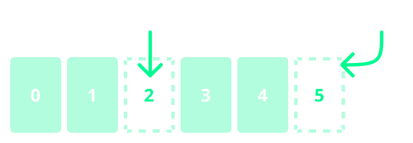
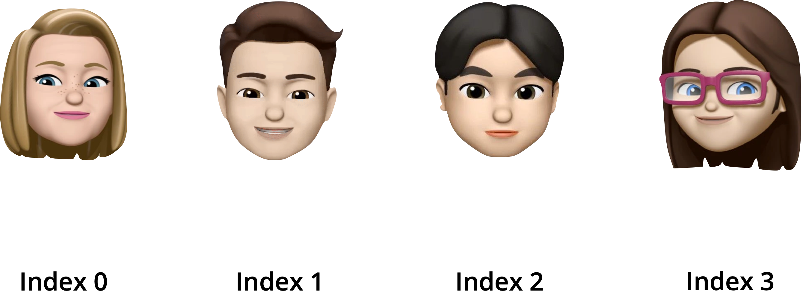
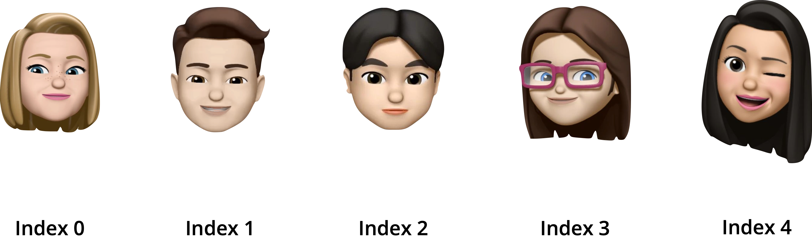
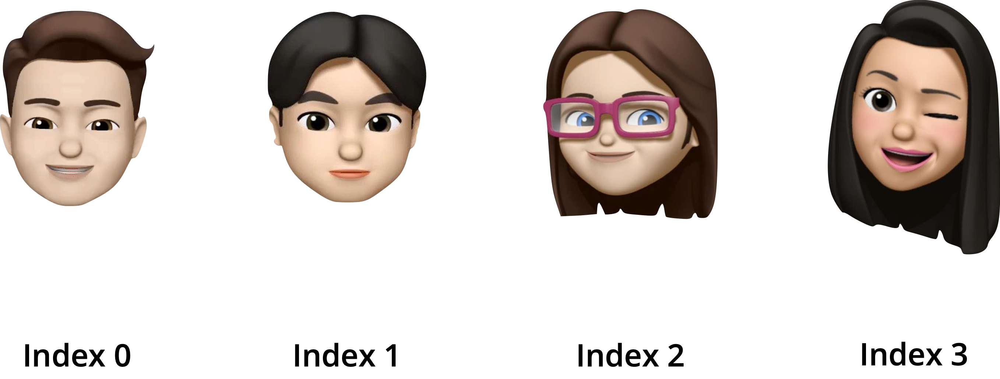
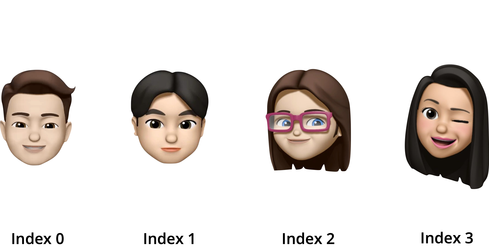
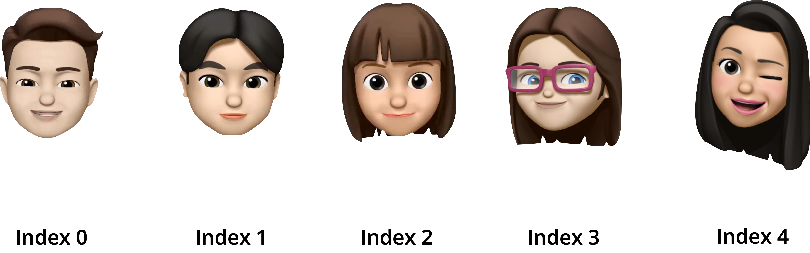

<div style="text-align: left">
    
    
</div>

## Track B: Project 3
# Quiz

Create a Quiz app in SwiftUI.

---

## Unit Overview
- Arrays: Show array of questions and a next button to move between them
- Structs: Organising with structs
- Alert: Showing the answer
- Sheet: Show score

---

# Arrays
Imagine an announcement in school, asking for your class to go somewhere. The announcer won’t call you out by name, one by one… they’ll ask for your class name, e.g. Secondary 2C. 

That’s a _single variable that has all of your names in an ordered list_ — an array!

---vertical---

## Without Arrays
What's wrong here?

```swift
var student1 = "Alice"
var student2 = "Bob"
var student3 = "Charles"
var student4 = "Eunice"
// oh no! we forgot one
var student5 = "Deborah"
// wait, they're not in order, we need to swap s4 and s5
var tempstudent = student5
student5 = student4
student4 = tempstudent
print(student4)
print(student5)

// Wait. . . Alice got food poisoning and dropped out
// Now we need to move everyone again
student1 = "I give up"
```

---vertical---

## Arrays
- Store multiple items in a single variable
- Much easier than working with dozens of variables!
- Start counting from 0



---vertical---

## With Arrays
```swift
var students = ["Alice", "Bob", "Charles", "Deborah"]
// Add a student!
students.append("Eunice")

print(students)
// Who 's the first student?
print(students[0])

// Remove a student!
students.remove(at: 0)
print(students)

// Oh we spelled Bob's name wrong
students[0] = "Blob"
print(students)
```

---vertical---

## Visualising Arrays
```swift
var students = ["Alice", "Bob", "Charles", "Deborah"]
```


---vertical---

## Visualising Arrays
```swift
students.append("Eunice")
```


---vertical---

## Visualising Arrays
```swift
students.remove(at: 0)
```


---vertical---

## Visualising Arrays
```swift
students[0] = "Blob"
```


---vertical---

## Visualising Arrays
```swift
print(students.count)
```


---vertical---

## Visualising Arrays
```swift
students.insert("Daisy", at: 2)
```


---vertical---

## Arrays
Terminology:
- **Array**: A collection that stores an ordered list of items
- **Index**: Integer representing position of item in array

Methods/variables:
- `.append(newElement)`: Add to the end
- `.insert(newElement, at:)`: Add to a certain index
- `.remove(at:)`: Remove from a certain index
- `.count`: How many items in the array

---vertical---

## Arrays in SwiftUI
### Goal: Create an app that shows a question on screen.
### The user can press a next and previous button to go back and forth.

---vertical---


---

# Structs

---

# Alerts

---

# Sheets

---
