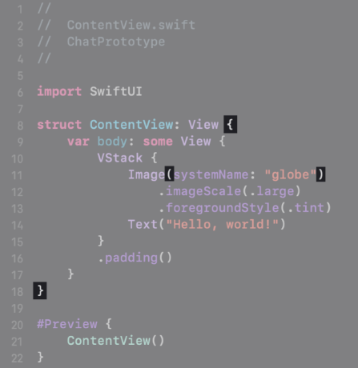
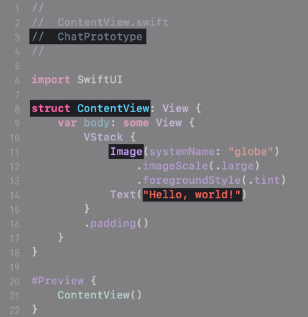
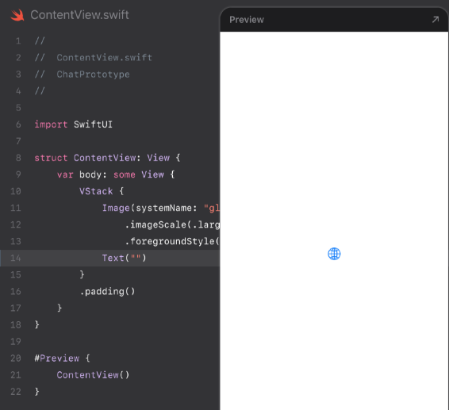
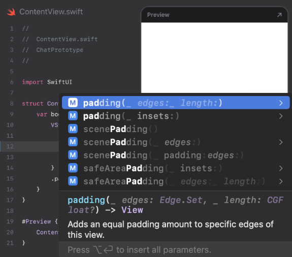
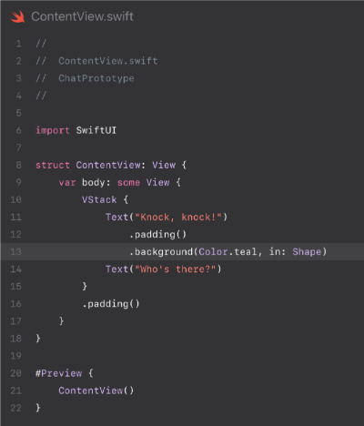

    
    

## Track B: Project 1.5 
# Chat Conversation
Unit 1: Making a chat conversation 

---

    

    	<h1>What is Swift?</h1>
    

    

		
	

---vertical---

    

    	<h1>What is Swift?</h1>
    	<ul>
    		<li>Swift is an open-source programming language created by Apple</li>
    		<li>Used by developers to build apps on iOS, iPadOS, macOS, watchOS, tvOS, and more.</li>
    

    

		
	

---

# Exploring the code... 

---vertical---

## Look through the code 

- Swift and SwiftUI are designed to be read like natural language. 
- Swift is the programming language you use to write your app's code. 
- SwiftUI is a _framework_ that provides views, controls, and layout structures for creating your app's user interface. 

---vertical---

    

    	<h2>Readability</h2>
    	<ul>
    		<li>Recognise the words?</li>
    		<ul><li><code>Image</code>, <code>Text</code>, and <code>.imageScale</code> all hint at how they create the interface.</li></ul>
    		<li>Note that <code>imageScale</code> is in camel case: The words are glued together without spaces, and each word after the first is capitalised.</li>
		</ul>
    

    

		
	

---vertical---

    

    	<h2>Braces</h2>
    	<ul>
    		<li>Look for the <em>braces</em> and <em>parenthesis</em> in your code.</li>
    		<li>Parentheses usually have information related to the code immediately before them. Braces are like containers - they usually group multiple lines of code into one chunk.</li>
    		<li>Try double-clicking an opening or closing brace!</li>
		</ul>
    

    

		
	

---vertical---

    

    	<h2>Indentation</h2>
    	<ul>
    		<li>Look at the <em>indents</em> in your code.</li>
    		<li>You use indentation to reflect the code's organisation which makes it more readable. However, code without any indentation will still run. </li>
		</ul>
    

    

		
	

---vertical---

    

    	<h2>Colours</h2>
    	<ul>
    		<li>Xcode colours different parts of your code according to their purpose.</li>
    		<ul><li>This is called syntax highlighting</li></ul>
    		<li>Some things, such as <code>struct</code>, are <em>keywords</em> in Swift, while others, such as <code>image</code>, are features of SwiftUI.</li>
		</ul>
    

    

		
	

---vertical---

    

    	<h2>Hello, world! </h2>
    	<ul>
    		<li>Find the text "Hello, world!" in the code. It's coloured red and surrounded by quotation marks.</li>
    		<li>Swift calls written language <code>String</code>.</li>
		</ul>
    

    

		
	

---

# Editing Code 

(and making mistakes!)

---vertical---

## Editing
- Change the code in the editor and see how the preview updates in response. 
- Xcode has features common to other text editors, like copy and paste, undo and redo, and text selection. 

---vertical---

    

    	<h2>Editing a String</h2>
    	<ul>
    		<li>Change the text inside the quotation marks to a word or phrase of your choice.</li>
    		<li>Make sure not to delete the quotation marks themselves.</li>
		</ul>
    

    

		
	

---vertical---

    

    	<h2>Errors</h2>
    	<ul>
    		<li>Now, make a deliberate mistake. Delete the string inside the Text, including the quotation marks.</li>
    		<li>Notice the error banner that popped up on the line of code you edited. When Xcode can't understand what you wrote in the eidtor, you'll see messages like this.</li>
		</ul>
    

    

		
	

---vertical---

    

    	<h2>Fixing the error</h2>
    	<ul>
    		<li>Start to correct the error by typing one quotation mark inside the parentheses.</li>
    		<ul><li>The editor may automatically insert a second one for you; if so, delete the second one.</li></ul>
    		<li>Sometimes you can cause temporary errors by putting the code in an invalid state as you type.</li>
    		<ul><li><code>Text</code> needs you to supply a string for it to display, but you haven't finished typing.</li></ul>
		</ul>
    

    

		
	

---vertical---

    

    	<h2>Fixing the error</h2>
    	<ul>
    		<li>Click the red icon at the head of the error banner to expand details for both errors. The new error is "Unterminated string literal."</li>
    		<ul><li>String literal is text inside quotation marks.</li></ul>
    		<li>If you begin a string with a quotation mark but don't close it with a second one, you've broken a rule about <em>string literals</em></li>
    		<ul><li>Notice that the closing parenthesis is now red, because Xcode's best guess is that the closing parenthesis is part of the string. </li></ul>
		</ul>
    

    

		
	

---vertical---

    

    	<h2>Fixing the error</h2>
    	<ul>
    		<li>Add a second quotation mark to fix the error.</li>
    		<li>The preview on the right now has no visible text &mdash; just a global image. That's because the text is an <em>empty string</em>, so there's no text to display.</li>
		</ul>
    

    

		
	

---vertical---

    

    	<h2>Moving on</h2>
    	<ul>
    		<li>Put your greeting string back in the <code>Text</code> view before you continue to the next section.</li>
    		<li>Your code is working again, and you've completed the first part of your conversation.</li>
		</ul>
    

    

		
	

---

# Adding to the conversation

---vertical---

## Views
- In SwiftUI, a view is part of the interface of an app. 
	- `Text` is one example of a view. 
- Views are disticnt from the data they display. 
	- `Text` is the view, and the `String` inside the parentheses is the data. 

---vertical---

    

    	<h2>Continuing</h2>
    	<ul>
    		<li>Delete the image view and the two lines below it. Then add a new line below the Text view.</li>
		</ul>
    

    

		
	

---vertical---

    

    	<h2>Adding components</h2>
    	<ul>
    		<li>Click the + button at the top of the project window, which opens the Library.</li>
    		<ul><li>You can also open the Library by choosing View &#62; Show Library.</li></ul>
    		<li>Use the Library for quick access to SwiftUI components, colours and images, as well as other items you'll use frequently when building an app. </li>
    		<ul><li>You can click and drag to position it.</li><li>To dismiss the Library, press Escape or click anywhere else on the screen.</li></ul> 
		</ul>
    

    

		
	

---vertical---

    

    	<h2>Adding components</h2>
    	<ul>
    		<li>Select the first icon under the search field to show the list of views.</li>
    		<li>Type "text" in the field at the top to narrow your search. Then, from the list below, select <code>Text</code></li>
    		<ul><li>To insert it into your code, double-click it or press Return.</li><li>The new view has a placeholder string in a blue capsule, which is highlighted by default.</li></ul> 
		</ul>
    

    

		
	

---vertical---

    

    	<h2>Editing the text</h2>
    	<ul>
    		<li>Type to replace the selected text with a new message. Remember to include quotation marks.</li>
		</ul>
    

    

		
	

---

# Modifiers

---vertical---

    

    	<h2>Adding a modifier</h2>
    	<ul>
    		<li>Add an empty line below the first <code>Text</code> view.</li>
    		<li>Type <code>.pad</code>, then pause to let Xcode show code completion suggestions.</li>
    		<ul><li>Use the arrow keys to highlight   <code>padding(_ edges:_length:)</code> in the menu, then press Return to insert the <code>.padding</code> modifier in your code.</li></ul> 
    		<li>You can show or hide code completion by pressing Escape.</li>
		</ul>
    

    

		
	

---vertical---

    

    	<h2>Padding</h2>
    	<ul>
    		<li>The <code>.padding</code> modifier adds extra space around the edges of a view to separate it from its surrounding views.</li>
    		<li>You apply modifiers to views using <em>dot notation</em>. That's why there's a period before the word padding.</li>
		</ul>
    

    

		
	

---vertical---

    

    	<h2>Background modifier</h2>
    	<ul>
    		<li>Add a second modifier to give the chat bubble a background colour and shape.</li>
    		<ul><li>Below <code>.padding</code>, type <code>.back</code>, then let Xcode show you code completion suggestions. Choose <code>background(_style:in:)</code> and press Return to add it to your code.</li></ul>
    		<li>There are often multiple versions of the same view or modifier</li>
    		<ul><li>This version lets you set the style <code>(style: ShapeStyle)</code> of the background and give it a shape <code>(in: Shape)</code>.</li></ul>
		</ul>
    

    

		
	

---vertical---

    

    	<h2>Background modifier</h2>
    	<ul>
    		<li>This modifier requires <em>arguments</em> between the parentheses to specify the style and shape.</li>
    		<li>Type <code>Color.teal</code> for the first argument, then press Tab to move to the next argument.</li>
    		<li>You can see other colour options by typing <code>Color.</code> and viewing the code completion list.</li>
		</ul>
    

    

		
	

---vertical---

    

    	<h2>Background modifier</h2>
    	<ul>
    		<li>Begin typing <code>RoundedRectangle</code> for the second argument to <code>.background</code></li>
    		<li>From the code completion list, choose the version of <code>RoundedRectangle</code> with an argument labelled <code>cornerRadius</code>, and set the value of the <code>cornerRadius</code> to 8.</li>
		</ul>
    

    

		
	

---vertical---

    

    	<h2>Order of modifiers</h2>
    	<ul>
    		<li>Before adding modifiers to the next chat bubble, reverse the order of the <code>.background</code> and <code>.padding</code> modifiers so that the padding comes after the background.</li>
    		<li>Notice how the chat bubble's appearance changes.</li>
		</ul>
    

    

		
	

---vertical---

    

    	<h2>Selectable mode</h2>
    	<ul>
    		<li>At the bottom leading corner of the preview, click the button to enter <em>selectable mode</em></li>
    		<li>In a live preview, you can interact with your interface to test it out.</li>
    		<li>In selectable mode, you can click elements in the preview to see more information about them and to highlight the corresponding code in the source editor.</li>
		</ul>
    

    

		
	

---vertical---

    

    	<h2>Selectable mode</h2>
    	<ul>
    		<li>Click the top message bubble to select it. Xcode shows the selection by drawin a thin blue border around it.</li>
    		<li>The selection rectangle encompasses the coloured bubble and the empty padding around it.</li>
		</ul>
    

    

		
	

---vertical---

    

    	<h2>Restoring the modifiers</h2>
    	<ul>
    		<li>Restore the original modifier order by putting the padding before the background.</li>
    		<li>Now the coloured bubble fills the selection rectangle</li>
		</ul>
    

    

		
	

---vertical---

## Order of modifiers
- Take a look at the sequence of modifiers in your code.
- The `.padding` modifier creates a new padded view with empty space around it, which is affected by any modifiers coming after it. 
- If you want the padded area to have a background colour, you must modify that padded view. 

---vertical---

    

    	<h2>Live mode</h2>
    	<ul>
    		<li>Change the preview back to live mode by clicking the button just before the selectable mode button.</li>
		</ul>
    

    

		
	

---vertical---

    

    	<h2>Customising the chat</h2>
    	<ul>
    		<li>Add padding and background to the second chat bubble, this time selecting a different colour &mdash; for example, <code>Color.yellow</code></li>
		</ul>
    

    

		
	

<!--Tinkercademy logo and info. (in case needed)

	

		
		

			<a style="display:block;color:inherit;" href="https://tinkercademy.com" target="_blank">
				
tinkercademy.com

			</a>
			<a style="display:block;color:inherit;" href="mailto:hello@tk.sg" target="_blank">
				
hello@tk.sg

			</a>
			
@tinkercademy

		

	

-->

<!--

	

-->
