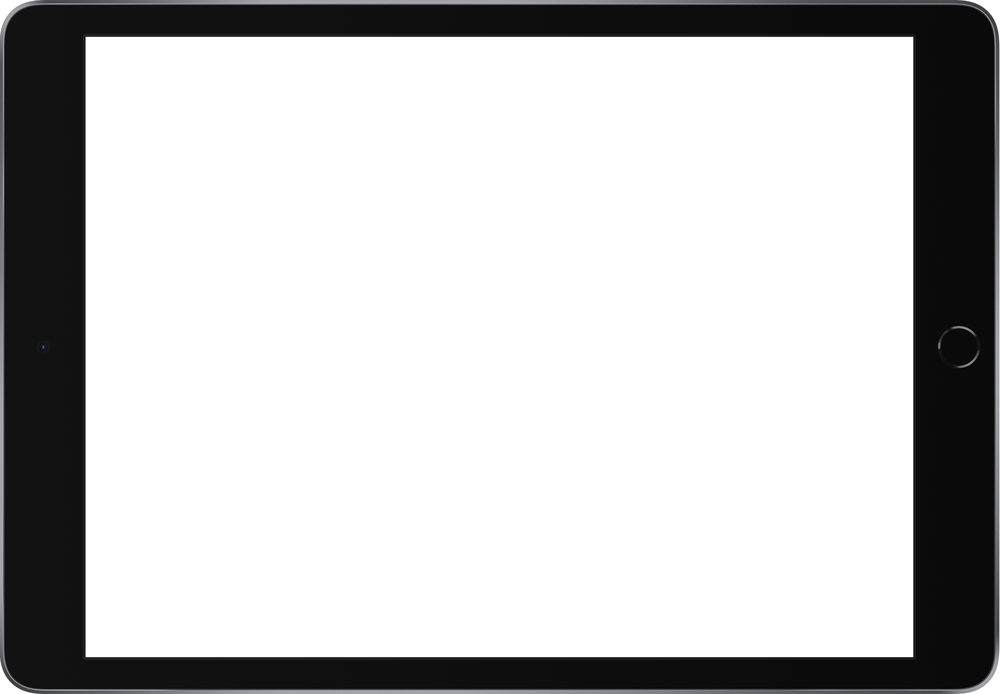
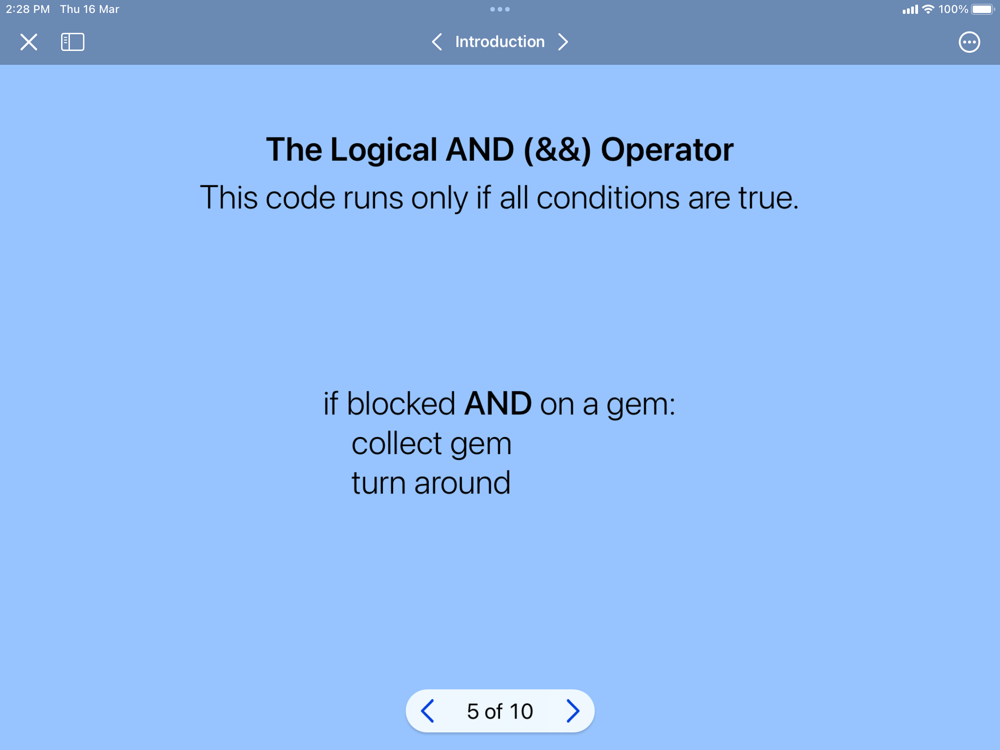

<div style="text-align: left">
    
    
</div>

## Track X: Unit 1

# Commands, For Loops, Conditional Code

---

# Phase Overview

- Commands
- For Loops
- Conditional Code

---

# Lesson Plan

### What you’ll learn:
- Commands
- For Loops
- Conditional Code

### What you’ll do:
- Get Started with Code on Swift Playgrounds

### What you’ll need:
- Swift Playgrounds App on your iPad

---

# What is Swift?

---vertical---

- Swift is an open-source programming language created by Apple.
- Used by developers to build apps for iOS, iPadOS, macOS, watchOS, tvOS, and more.

---

# Introduction to Swift Playgrounds

---vertical---

### Getting Started

1. Open the **Swift Playgrounds** app on your iPad.
2. Under “Get a Playground,” tap on **Get Started with Code**.

---vertical---

### Navigating the Playground

- Tap on the **sidebar icon** to navigate through different chapters.
- Tap on the **X icon** to return to **My Playgrounds**.

---vertical---

### What you will be doing:

- Control a character, Byte, using Swift.
- Navigate around the game world and complete tasks such as toggling switches and collecting gems.

---

# Commands

---vertical---

<div style="display: flex; justify-content: center; align-items: center;">
  <div style="position: relative; width: 1400px; height: 1000px;">
    
    
  </div>
</div>

---vertical---

<div style="display: flex; justify-content: center; align-items: center; height: 100%; width: 100%; padding: 20px;">
  <div style="position: relative; width: 1050px; height: 650px;">
    
    
  </div>
  <div style="position: relative; width: 1050px; height: 650px;">
    
    
  </div>
</div>

---vertical---

### Controlling Byte
<div style="display: flex; justify-content: center; align-items: center;">
  <div style="position: relative; width: 1400px; height: 1000px;">
    
    
  </div>
</div>

---vertical---

# camelCase
- Commands have no spaces between words
- If your command has two or more words, the standard practise is to capitalise the first letter of every word EXCEPT the first word
- e.g. moveForward(), collectGem()

---vertical---

# Introduction to the interface
<div style="display: flex; justify-content: center; align-items: center;">
  <div style="position: relative; width: 1050px; height: 700px;">
    
    
  </div>
</div>

---vertical---

## Let's try issuing commands!
After tapping Tap to enter code, you can either 
- Type the code out or, 
- Use the keyboard shortcuts and the bottom of the screen

After you are done with the code, click Run My Code to see Byte in action! 

You can tap on **Speedometer** to speed Byte up or step through the code step by step  

---vertical---

# Hands-On
### Try out the exercises under Commands!
<div style="display: flex; justify-content: center; align-items: center;">
  <div style="position: relative; width: 1050px; height: 700px;">
    
    
  </div>
</div>

---

# For Loops

---vertical---

<div style="display: flex; justify-content: center; align-items: center; height: 100%; width: 100%; padding: 20px;">
  <div style="position: relative; width: 1050px; height: 650px;">
    
    
  </div>
  <div style="position: relative; width: 1050px; height: 650px;">
    
    
  </div>
</div>

---vertical---

<div style="display: flex; justify-content: center; align-items: center; height: 100%; width: 100%; padding: 20px;">
  <div style="position: relative; width: 1050px; height: 650px;">
    
    
  </div>
  <div style="position: relative; width: 1050px; height: 650px;">
    
    
  </div>
</div>

---vertical---

### Syntax

```swift
for i in 1 ... 5 {
    // code to be repeated
}
```

---vertical---

### What is `i`?

- `i` is a variable. It represents a value and can be named anything (e.g., `i` or `potato`).
- The for loop sets `i` to 1 initially and repeats the code inside the curly brackets for each value of `i` until the loop ends.

---vertical---

# Hands-On
### Try out the exercises under For Loops!
<div style="display: flex; justify-content: center; align-items: center; height: 100%; width: 100%; padding: 20px;">
  <div style="position: relative; width: 1050px; height: 650px;">
    
    
  </div>
  <div style="position: relative; width: 1050px; height: 650px;">
    
    
  </div>
</div>

---

# Conditionals

---vertical---

<div style="display: flex; justify-content: center; align-items: center;">
  <div style="position: relative; width: 1400px; height: 1000px;">
    
    
  </div>
</div>

---vertical---

<div style="display: flex; justify-content: center; align-items: center; height: 100%; width: 100%; padding: 20px;">
  <div style="position: relative; width: 1050px; height: 650px;">
    
    
  </div>
  <div style="position: relative; width: 1050px; height: 650px;">
    
    
  </div>
</div>

---vertical---

<div style="display: flex; justify-content: center; align-items: center; height: 100%; width: 100%; padding: 20px;">
  <div style="position: relative; width: 1050px; height: 650px;">
    
    
  </div>
  <div style="position: relative; width: 1050px; height: 650px;">
    
    
  </div>
</div>

---vertical---

### if-else Syntax

```swift
if condition {
    // code if condition is true
} else {
    // code if condition is NOT true
}
```

---

# Comparators

---vertical---

### Comparators

In the Playgrounds tutorial, the if statement uses the value of isOnClosedSwitch or isOnGem to make decisions.

These are boolean (Bool) variables, which can be either true or false.
- isOnClosedSwitch represents whether a switch is closed
- isOnGem represents whether Byte is on a gem

We can also directly use statements using comparators (<=, <, >, >=, ==, !=) instead of boolean variables.
- For example, a == b will be true if a is equal to b, and false if a is not equal to b.

---vertical---

<div style="display: flex; justify-content: center; align-items: center; height: 100%; width: 100%; padding: 20px;">
  <div style="position: relative; width: 1050px; height: 650px;">
    
    
  </div>
  <div style="position: relative; width: 1050px; height: 650px;">
    
    
  </div>
</div>

---vertical---

# Hands-On
### Try out the exercises under Conditionals!
<div style="display: flex; justify-content: center; align-items: center; height: 100%; width: 100%; padding: 20px;">
  <div style="position: relative; width: 1050px; height: 650px;">
    
    
  </div>
  <div style="position: relative; width: 1050px; height: 650px;">
    
    
  </div>
  <div style="position: relative; width: 1050px; height: 650px;">
    
    
  </div>
</div>
