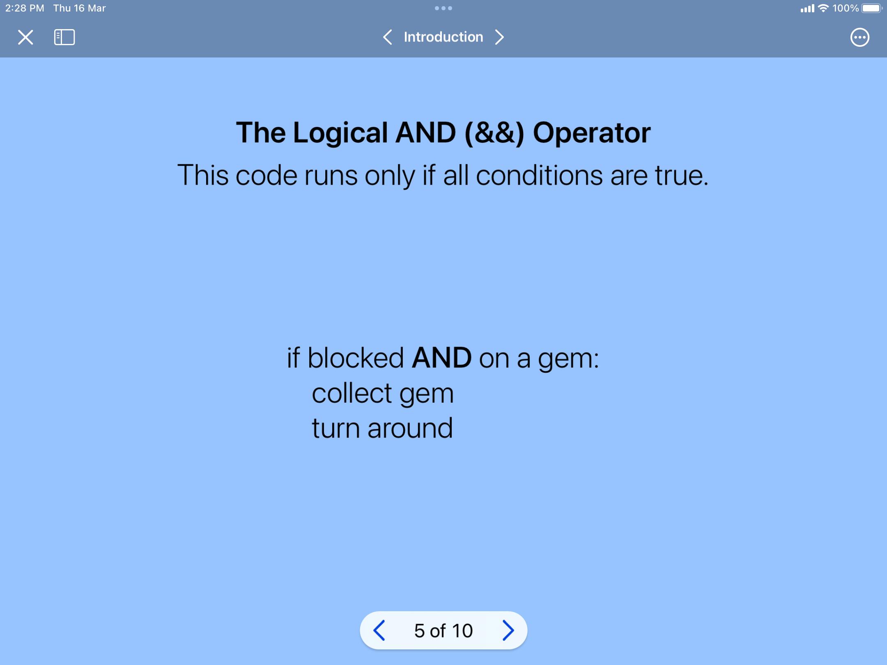
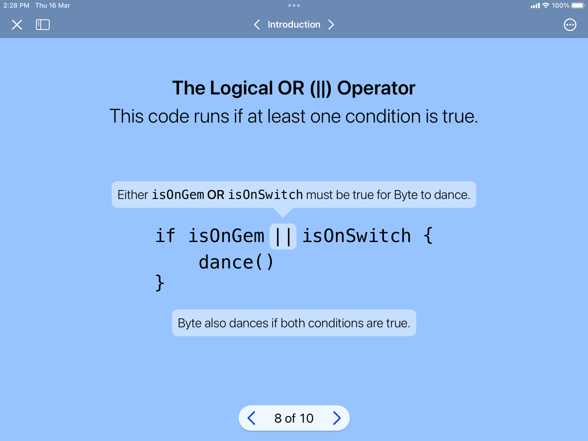
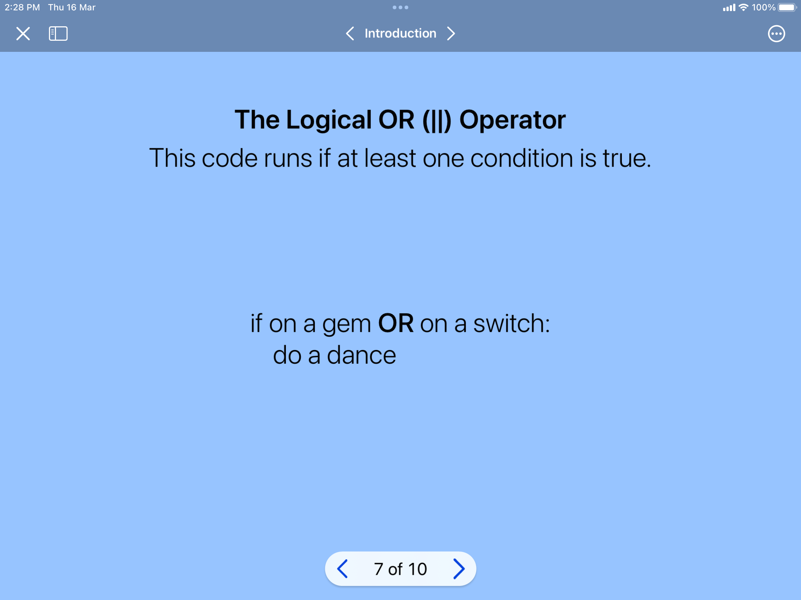
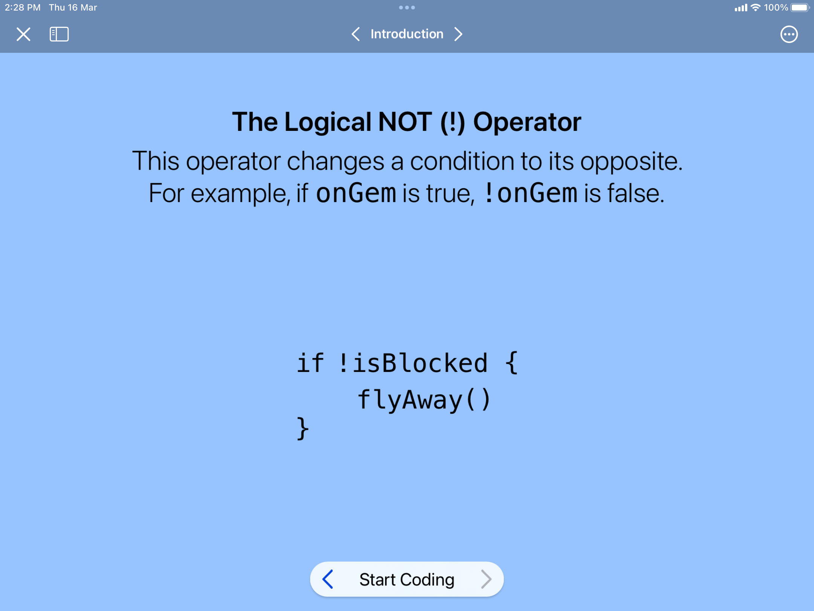
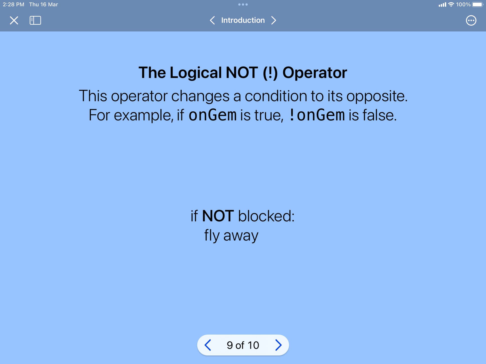
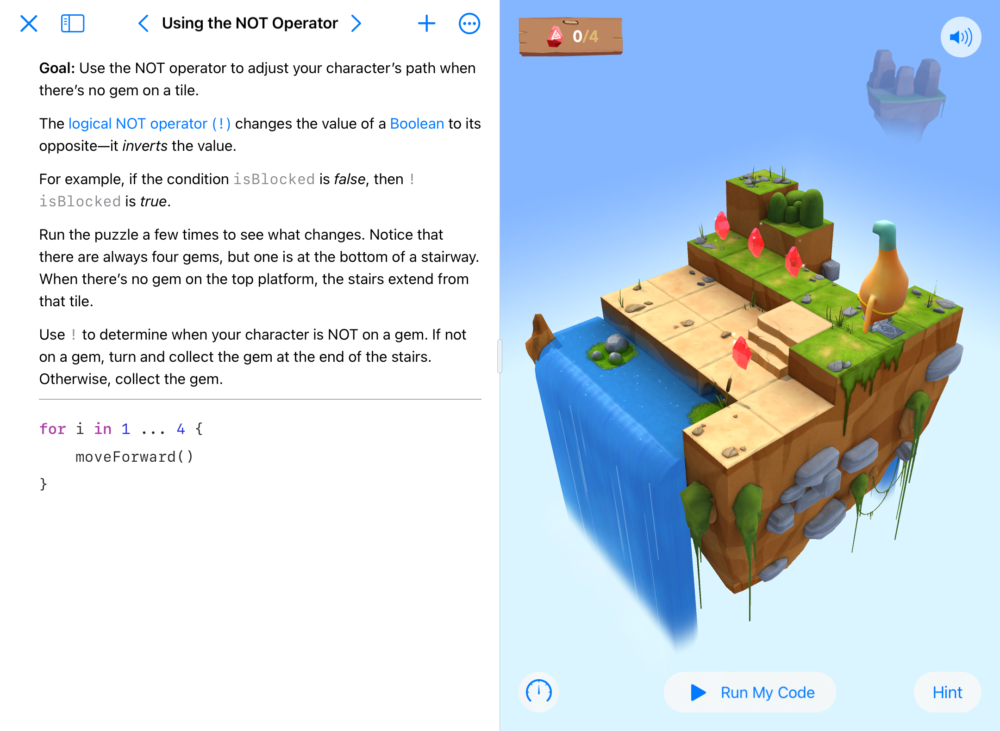

<div style="text-align: left">
    
    
</div>

## Track A: Unit 2

# Logical Operators, Variables, Types

---

# Lesson Plan

### What you’ll learn
- Logical Operators  
- Variables  
- Types  

### What you’ll do
- Get Started with Code on Swift Playgrounds  

### What you’ll need
- Swift Playgrounds App on your iPad  

---

# Logical Operators

---vertical---

## Logical Operators: `&&`

---vertical---

<div style="text-align: center;">
    
    
</div>


---vertical---

<div style="display: flex; justify-content: center; align-items: center;">
  <div style="position: relative; width: 400px; height: 400px; margin: 10px;">
    
    
  </div>
  <div style="position: relative; width: 400px; height: 400px; margin: 10px;">
    
    
  </div>
</div>

---vertical---

<div style="display: flex; justify-content: center; align-items: center;">
  <div style="position: relative; width: 400px; height: 400px; margin: 10px;">
    
    
  </div>
  <div style="position: relative; width: 400px; height: 400px; margin: 10px;">
    
    
  </div>
</div>

---vertical---

<div style="display: flex; justify-content: center; align-items: center; gap: 40px; padding: 20px;">
  <div style="position: relative; width: 700px; height: 450px;">
    
    
  </div>
  <div style="position: relative; width: 700px; height: 450px;">
    
    
  </div>
</div>

---vertical---

# Hands-On

### Try out the exercise under Logical Operators!

<div style="text-align: center;">
    
    
</div>

---

# Variables

---vertical---

## Variables Summary

- Variables represent values, and those values can change.  
- Declare a variable:  
  ```swift
  var variableName = 0