<div style="text-align: left">
    
    
</div>

## Track B : Unit 1A

# Compose with Stacks and Shapes

>

---

# Set Up an App Playground

---vertical---

### Create a New App

<div style="display: flex;">
    <ul>
        <li>Tap App to start a new app playground.</li>
    </ul>
    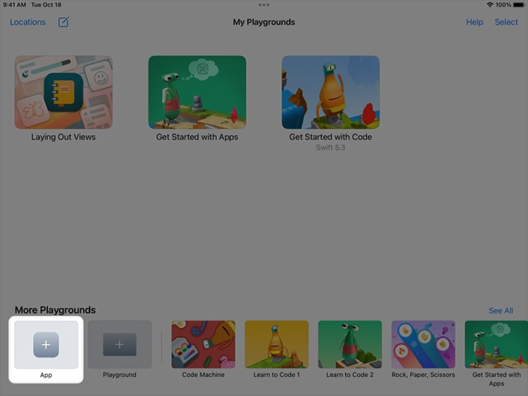
</div>

---vertical---

## Rename the App

<ol>
<li>Tap and hold on the app playground until the menu appears</li>
<li>Give your project a descriptive name, like “Self Portrait,” and tap Done.</li>
<ol>
<div style="display: flex;justify-content: center; align-items: center;">
    <div style="flex: 1;text-align: center;">    
        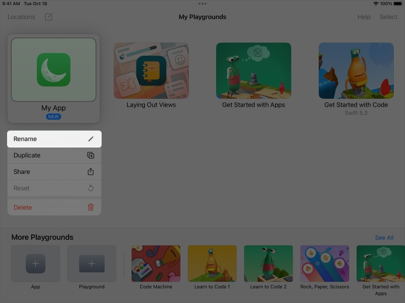
    </div>
    <div style="flex: 1;text-align: center;">
        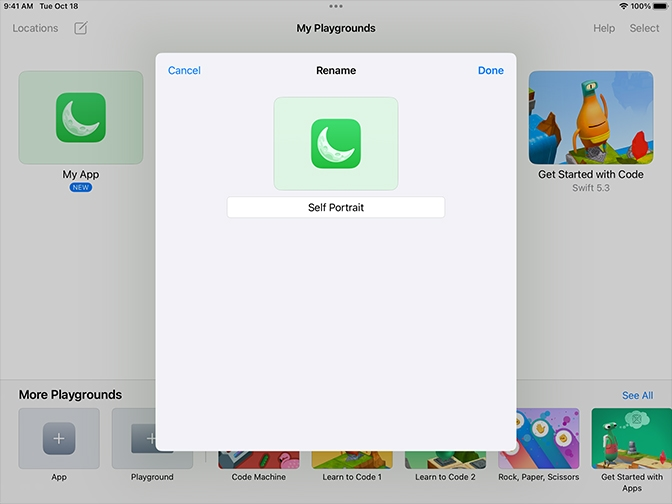
    </div>
</div>

---vertical---

## Remove the Default Text

-   Delete the image and text in the `VStack (vertical stack)`
-   Give your project a descriptive name, like “Self Portrait,” and tap Done.

<div style="display: flex;justify-content: center; align-items: center;">
    <div style="flex: 1;text-align: center;">    
        
    </div>
    <div style="flex: 1;text-align: center;">
        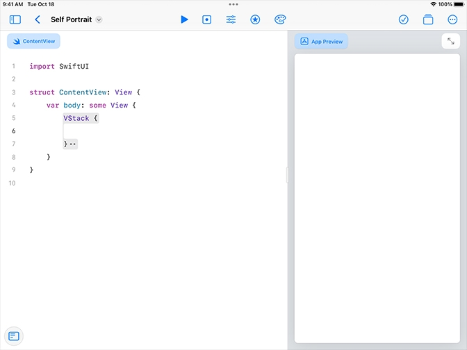
    </div>
</div>

---

# Self Portrait App

---vertical---

## Adding a ZStack

-   Change the VStack to a `ZStack (depth stack)`

<div style="display: flex;justify-content: center; align-items: center;">
    <div style="flex: 1;text-align: center;">    
        
    </div>
</div>

---vertical---

## Adding a Face

-   Open the list of views  and scroll to the bottom to find the capsule, circle, ellipse, rectangle, and rounded rectangle shapes.

<div style="display: flex;justify-content: center; align-items: center;">
    <div style="flex: 1;text-align: center;">    
        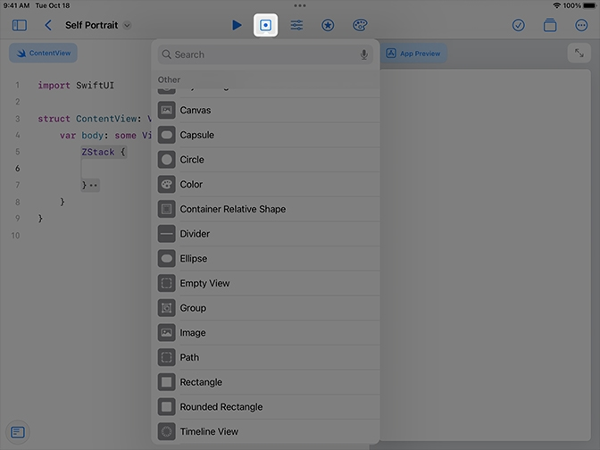
    </div>
</div>

---vertical---

## Adding a Face

-   Add a shape to the ZStack for your head. Use a `RoundedRectangle` for a square face, or a `Capsule` for a rounder face.

<div style="display: flex;justify-content: center; align-items: center;">
    <div style="flex: 1;text-align: center;">    
        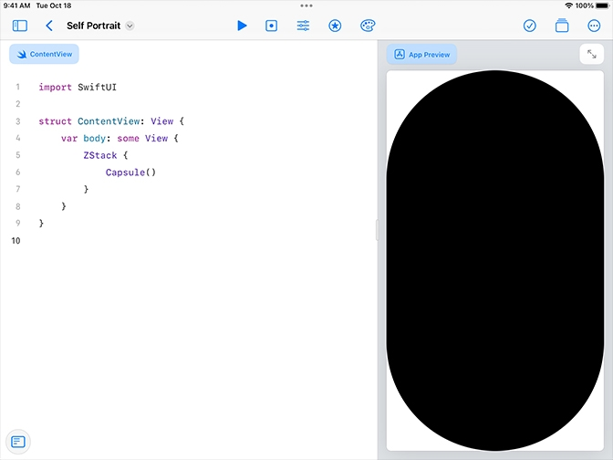
    </div>
</div>

---vertical---

## Tip: Rounded Rectangle

-   `RoundedRectangle` require a `cornerRadius` parameter to be set.

```swift[6]
import SwiftUI

struct ContentView: View {
    var body: some View {
        ZStack {
            RoundedRectangle(cornerRadius: 20)
        }
    }
}
```

<p> ContentView.swift</p>

---vertical---

## Shaping the Face

-   Add a blank line below the capsule, then open the list of modifiers.

<div style="display: flex;justify-content: center; align-items: center;">
    <div style="flex: 1;text-align: center;">    
        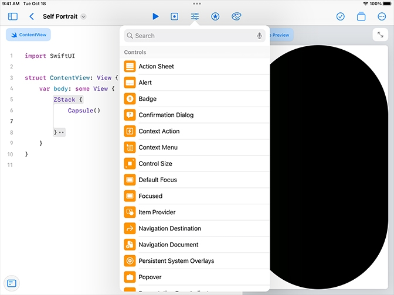
    </div>
</div>

---

# `Frames` and `foregroundStyle`

---vertical---

## Shaping the Face

-   Search for `frame` and tap to add it to your code.
-   Fill in the approximate values for height and width to create your head.

<div style="display: flex;justify-content: center; align-items: center;">
    <div style="flex: 1;text-align: center;">    
        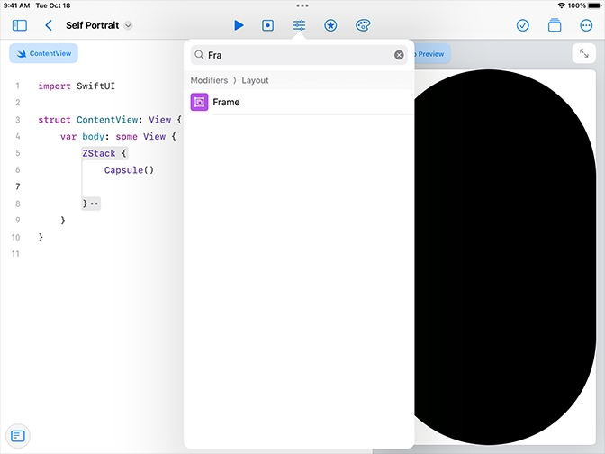
    </div>
    <div style="flex: 1;text-align: center;">
        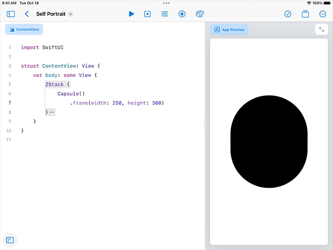
    </div>
</div>

---vertical---

## Colouring the Face

-   Add a blank line below `frame`, then open the list of modifiers.
-   Type `foregroundStyle` into the search bar. Tap to add it to your code.

<div style="display: flex;justify-content: center; align-items: center;">
    <div style="flex: 1;text-align: center;">    
        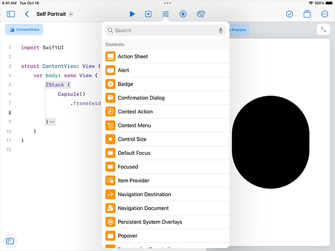
    </div>
    <div style="flex: 1;text-align: center;">
        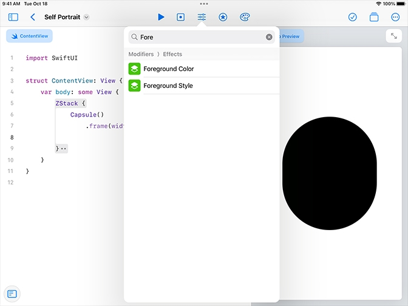
    </div>
</div>

---vertical---

## Colouring the Face

-   To change the colour, select the code inside the parentheses and open the list of colours.
-   Tap any colour to add it to your code.

<div style="display: flex;justify-content: center; align-items: center;">
    <div style="flex: 1;text-align: center;">    
        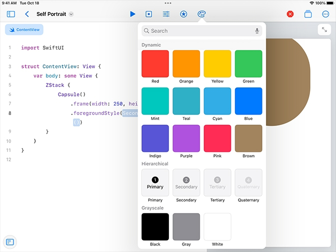
    </div>
    <div style="flex: 1;text-align: center;">
        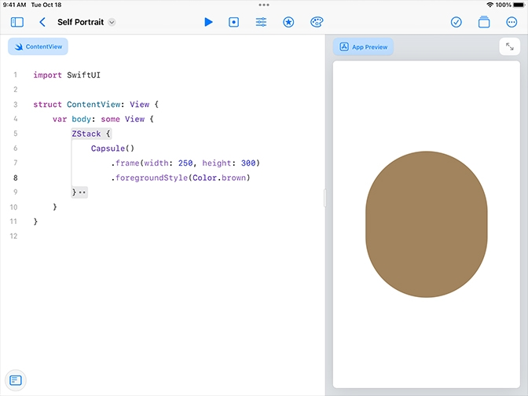
    </div>
</div>

---vertical---

## Tip: Custom colours

-   Optionally, create your own colour. Choose one of the code snippets, then edit the values to match your skin tone.

<div style="display: flex;justify-content: center; align-items: center; gap: 20px;">
<div style="flex: 1;text-align: center;">

```swift
// Add colour with RGBA
.foregroundStyle(Color(
    red: 0.6,
    green: 0.4,
    blue: 0.3,
    alpha: 1.0
))
```

</div>
<div style="flex: 1;text-align: center;">

```swift
// Add colour with HSV
.foregroundStyle(Color(
    hue: 0.1,
    saturation: 0.9,
    brightness: 0.4
))
​
```

</div>
​<!-- dont remove the empty lines in the "second colour segment -->
</div>

---

# Offset and Trim

---vertical---

## Creating the neck

-   Apply what you’ve learned to add a **rectangle** for your neck and adjust the size with a `frame` modifier.

<div style="display: flex;justify-content: center; align-items: center;">
    <div style="flex: 1;text-align: center;">    
        
    </div>
</div>

---vertical---

## Adjusting the Neck

-   Add a blank line below the rectangle, then search for `offset` in the list of modifiers.

<div style="display: flex;justify-content: center; align-items: center;">
    <div style="flex: 1;text-align: center;">    
        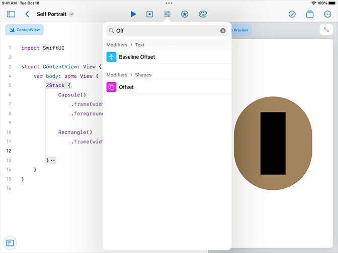
    </div>
    <div style="flex: 1;text-align: center;">
        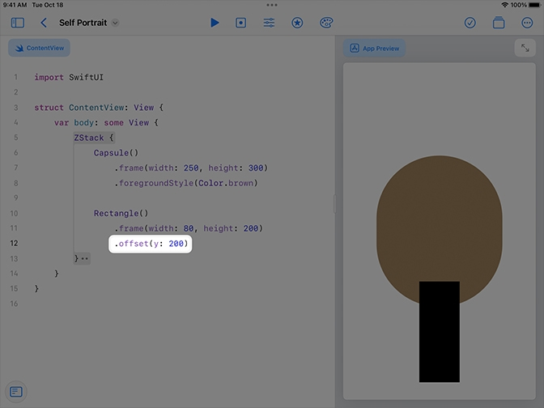
    </div>
</div>

---vertical---

## Adjusting the Neck

-   Move the neck under the head.
-   Select the rectangle and any modifiers you added. Cut and paste the code to the top of the depth stack. Then change the colour to match your head.

<div style="display: flex;justify-content: center; align-items: center;">
    <div style="flex: 1;text-align: center;">    
        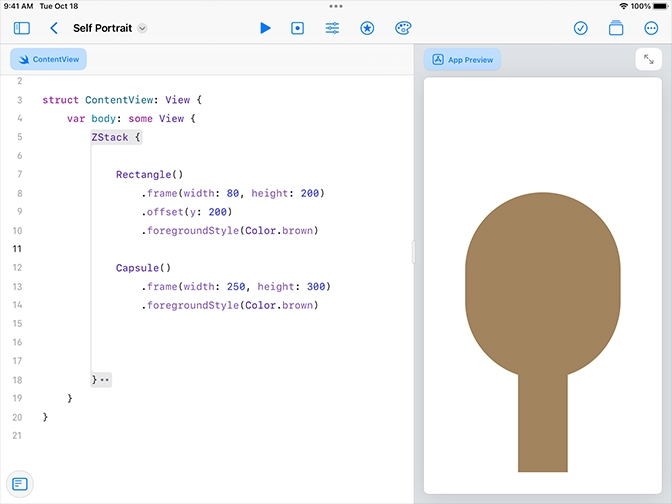
    </div>
</div>

---vertical---

## Adding a shirt

-   Apply what you’ve learned to add a shirt, place it correctly on the screen, and give it a colour.

<div style="display: flex;justify-content: center; align-items: center;">
    <div style="flex: 1;text-align: center;">    
        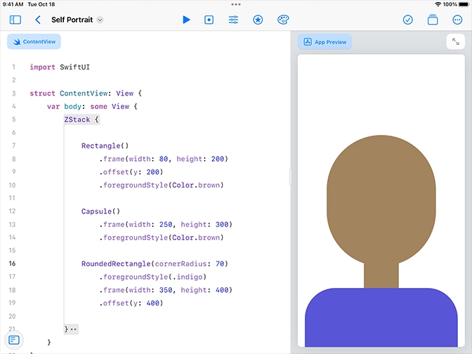
    </div>
</div>

---vertical---

## Adding Hair

-   Add a circle for your hair. Use `frame` to make it about the same width as your head or slightly larger.

<div style="display: flex;justify-content: center; align-items: center;">
    <div style="flex: 1;text-align: center;">    
        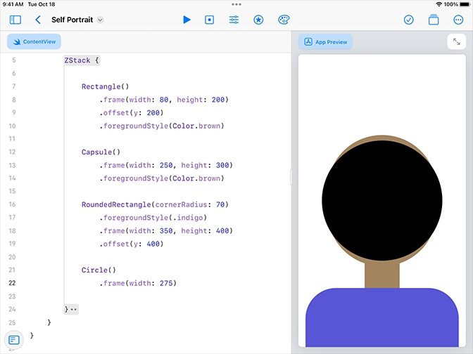
    </div>
</div>

---vertical---

## Adding Hair

-   Note: The `trim` modifier must come directly below a shape.
-   Experiment with values for where the trim should start and end.

<div style="display: flex;justify-content: center; align-items: center;">
    <div style="flex: 1;text-align: center;">    
        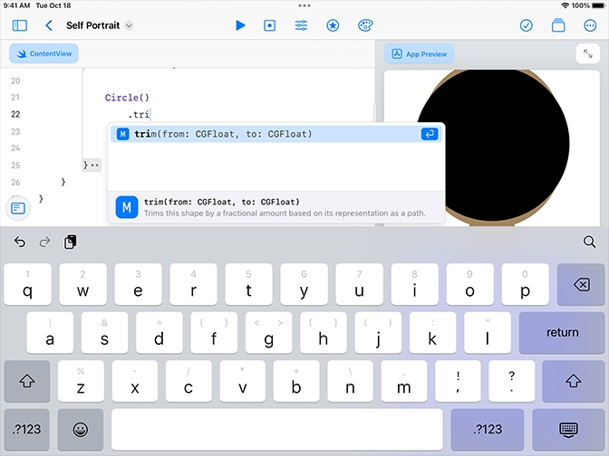
    </div>
    <div style="flex: 1;text-align: center;">
        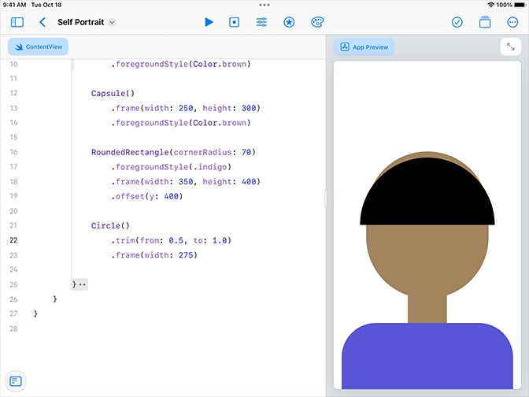
    </div>
</div>

---vertical---

## Adding Hair

-   Adjust the location of the bangs or short hair. Continue adding any remaining elements to complete your hair.

<div style="display: flex;justify-content: center; align-items: center;">
    <div style="flex: 1;text-align: center;">    
        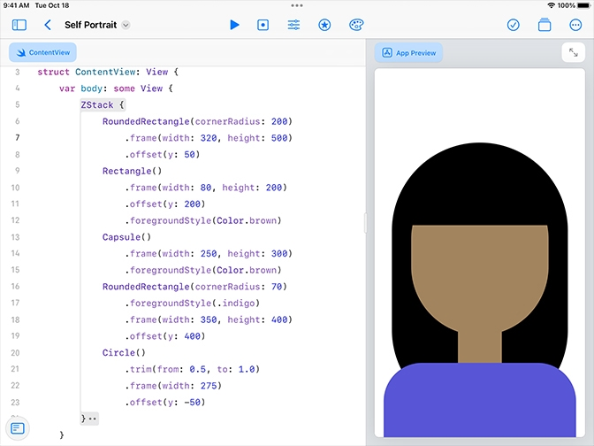
    </div>
</div>

---vertical---

## Tip: Many views in a stack

-   If you have more than ten views in a stack, you’ll get an “Extra arguments at position…” warning. To fix this, you can add a `Group` view to the stack.

<div style="display: flex;justify-content: center; align-items: center;">
    <div style="flex: 1;text-align: center;">    
        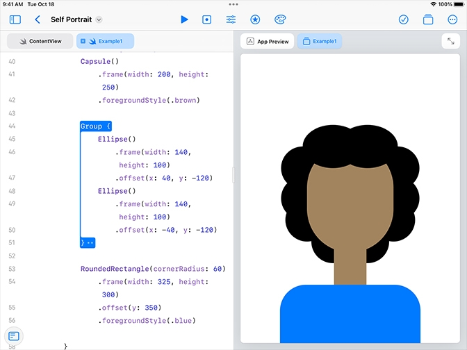
    </div>
</div>

---

# Shadow and Background Colour

---vertical---

## Shadow behind the head

-   Locate the shape that creates your head in the code. Add a blank line below the shape, then search for `shadow` in the list of modifiers.

<div style="display: flex;justify-content: center; align-items: center;">
    <div style="flex: 1;text-align: center;">    
        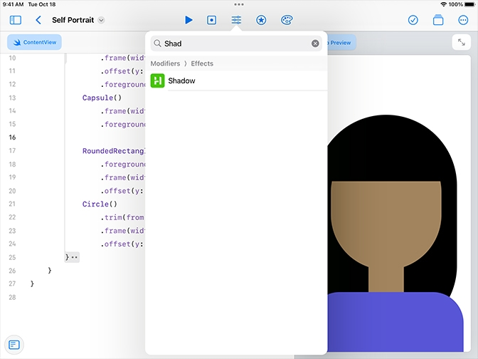
    </div>
    <div style="flex: 1;text-align: center;">
        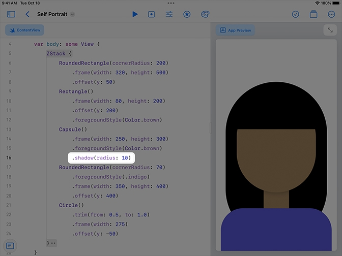
    </div>
</div>

---vertical---

## Shadow: Colour

-   Optionally, add a colour to the shadow.

```swift
.shadow(color: .black, radius: 10)
```

---vertical---

## Background colour

-   Add a blank line at the top of your `ZStack`, then open the list of colours. Tap a colour to add it to your code.

<div style="display: flex;justify-content: center; align-items: center;">
    <div style="flex: 1;text-align: center;">    
        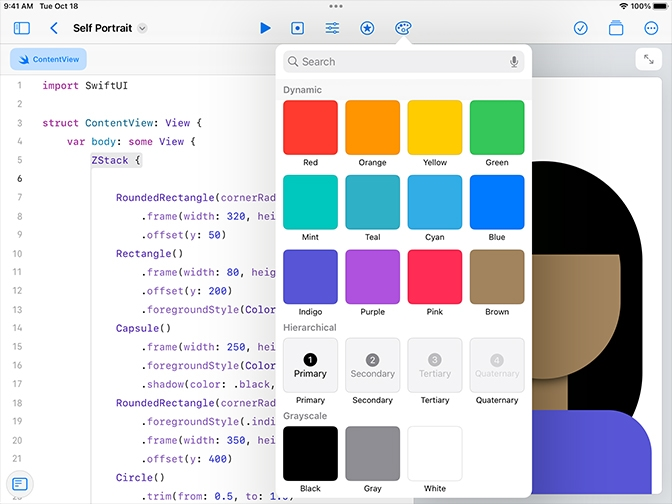
    </div>
</div>

---vertical---

## Background colour but lighter

-   Optionally, add an `opacity` modifier to dim the background colour.

<div style="display: flex;justify-content: center; align-items: center;">
    <div style="flex: 1;text-align: center;">    
        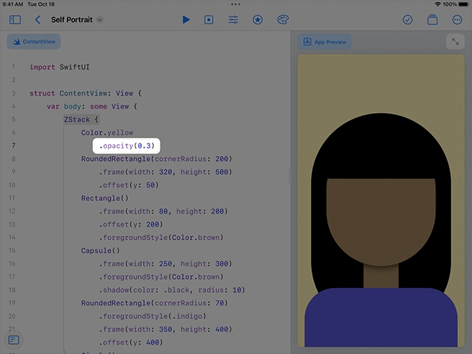
    </div>
</div>

---

# And that's it!

---

### 🔢 Self Portrait App

# Full Code

[Download Completed Project](https://github.com/tinkercademy/swift-demo-projects/raw/main/Self%20Portrait.zip/)